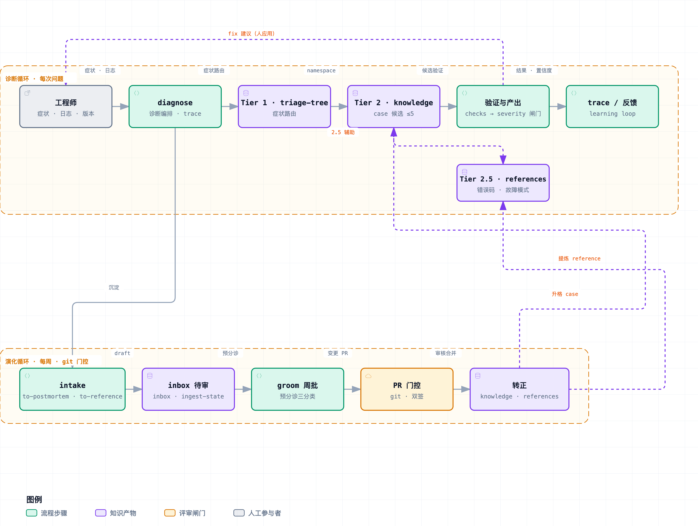

# ascend-sleuth

[](https://www.hiascend.com/)

昇腾训练与推理支持的诊断工具套件。把每次问题定位沉淀成可复用的知识，让下一次同类问题直接命中答案。

遵循 [Agent Skills](https://agentskills.io/) 标准，可在 pi、Claude Code、Codex 等任意支持该标准的 agent 中使用。

> ⚠️ **agent 执行差异**：不同 agent 对 SKILL.md 的执行质量有差异（prompt 纪律是概率性的，设计原则二明确承认）。诊断结果与 trace 质量可能因 agent 而异——**团队内建议统一 agent**，并在跨 agent 对比结果时先归因执行差异，不急于归因知识错误。

**快速跳转**：[为什么需要](#为什么需要它) · [快速开始](#快速开始) · [六个 skill](#六个-skill) · [工作原理](#工作原理) · [文档](#文档)

---

## 为什么需要它

昇腾支持工程师每天面对三类问题：训练或推理中断（hang、crash、OOM）、精度异常（loss 发散、FP8 衰减）、性能退化（吞吐下降、通信占比过高）。这些问题的根因高度重复，相关知识却分散在个人笔记、IM 聊天和各处 wiki 里。新 case 每周都在出现，A2/A3/A5 平台差异还在扩大，依赖个人手工维护的方案撑不过几周。

ascend-sleuth 把这些经验沉淀为结构化知识库：诊断时按症状路由到已验证的 case；问题定位结束后，新知识进入待审队列，由每周一次的例行维护完成去重、升格与退休。知识随使用不断校准，不依赖某个人的持续投入。

## 快速开始

### 安装（使能 skills）

**主路径——仓库即 workspace，skills 随仓使能**：clone 本仓，把 agent 的**项目级 skills 目录指向 `<clone>/skills/`**（skills/ 是单一事实源，git 版本管理；更新 = git pull，**热刷新即时生效**，不是重装）。装齐六个：`diagnose` / `to-postmortem` / `to-reference` / `issue-ingest` / `knowledge-groom` / `resume-diagnosis`。

**零配置（DSH，团队主力）**：仓库已跟踪 `.dsh/skills → ../skills` 相对 symlink——**clone 后自动还原，DSH 项目 root 自动发现 + watch 热刷新**（git pull 更新 SKILL.md 即时生效，无需任何配置）。

**其他 agent 按需建**（仓库不携带额外 symlink，保持根目录干净）：

```bash
bash scripts/enable-agent-skills.sh    # 检测已安装 agent，建项目级 skills symlink（幂等，可重跑）
```

各 agent 的项目级 skills 目录（脚本自动建 symlink，也可手动）：

| Agent | 项目级 skills 目录 |
|---|---|
| Claude Code | `.claude/skills` |
| Cursor | `.cursor/skills`（官方确认自动发现）|
| Trae | `.trae/skills` |
| CodeBuddy / WorkBuddy | `.codebuddy/skills` |
| Codex（OpenAI）| `.codex/skills` |
| DSH | `.dsh/skills`（仓库已跟踪，无需脚本）|

> `.agents/skills` 未使用：仅 DSH 支持（已被 `.dsh/skills` 覆盖），无其他 agent 以其为项目级 skills 目录。

**Windows**：若 git 未开 `core.symlinks=true`，clone 不还原 symlink——跑一次 `enable-agent-skills.sh` 补建。

加载后在 agent 里以 `/skill:<name>` 调用。

**分发路径——把方法论装进别的项目试用**（不沉淀回本仓）：

```bash
npx skills@latest add pillumina/ascend-sleuth -s diagnose -s to-postmortem -s to-reference -s issue-ingest -s knowledge-groom -s resume-diagnosis
```

`npx skills` 装的是 skills/ 副本（更新需重装），适合"别的项目里临时试用诊断方法论"；本仓团队使用走主路径（仓库即 workspace）。

### 一个诊断

把客户提供的症状、框架、日志片段告诉 agent——agent 不访问客户环境，所有信息由你提供：

```
/skill:diagnose

客户 A5 (950) 训练在 step ~3000 hang，all_to_all timeout，world_size=128。
框架 mindspeed-llm 2.5.0。报错栈尾：[粘贴相关 rank 的日志片段]
```

agent 路由到 `training/mindspeed-llm/` 并匹配 case。命中时给出结构化结果（CASE-ID、confidence、fix、rollback），未命中时转入深度排查。信息不足时，agent 会明确告诉你需要向客户补充什么。整个过程记录 trace——即使被打断，也能用 `/skill:resume-diagnosis` 从断点继续。

### 沉淀一次定位

任何来源的调查——本地 agent 会话、Kimi 对话、手工笔记、wiki 导出——都能汇入知识库：

```
/skill:to-postmortem "[粘贴对话或笔记]"                       # 内联
/skill:to-postmortem ~/cases/custA/notes.md                    # 单个文件
/skill:to-postmortem ~/cases/custA/ ~/cases/custB/hang.md      # 多文件
/skill:to-postmortem ~/cases/wiki-export/                      # 目录（批量导入）
```

agent 提取症状与根因，给出命名空间建议供你确认，生成 YAML 草稿与 postmortem 并完成脱敏，产出到待审队列。也可以在一次 `/skill:diagnose` 结束后直接说"沉淀一下这次"，agent 会自动触发。

## 知识获取

**仓库即 workspace**：诊断（读 knowledge/references/triage-tree）与沉淀（写 postmortems/inbox/、references/、ingest-state.json）都在**同一个仓库 clone** 里进行——SKILL 的知识路径相对仓根。三种起步形态如下，安装命令的差异在 `-g`（git 模式）和 `-s`（skill 选择）：

| 形态 | 起步方式 | 结果 | 适合谁 |
|---|---|---|---|
| **自积累**（空仓起步） | `git clone` 本仓（或 fork）后清空 `knowledge/` | 结构完整（skills/ + knowledge/ 空 + 队列/状态就位），从零沉淀 | 新团队、问题域不同、知识要私有 |
| **消费现成**（带知识库） | `git clone` 整个仓库（含 `knowledge/` 与 `references/`）| 直接用上游验证过的 case/reference，也可继续沉淀 | 已有沉淀、问题域重叠、想复用 |
| **定制知识面**（稀疏拉取） | `git clone` 后用 `git sparse-checkout` 收窄白名单 | **只收窄 case 数据**（`knowledge/` 子集）；方法论/工具/索引**全量**（见下）| 知识库长大后、带宽/存储受限、只要自己框架的知识 |

> ⚠️ **`-s` 只装 skill 不构成可用形态**——SKILL 的知识路径（postmortems/inbox/、references/、ingest-state.json）相对仓根，没有知识仓结构（knowledge/references/postmortems/ + 队列/状态文件）的"裸 skill"无法沉淀。`-s` 仅适合**在已有仓库里临时试用诊断方法论**（不沉淀回本仓），或把 `skills/` 合并进自己已有结构的仓库。

三种形态共用同一套 skill 与机制，且可递进：自积累的团队脱敏后可选回馈上游，让公开库渐厚（见 [部署模式](#部署模式) 的框架式）。`-g` 与 `-s` 的确切行为以 `npx skills add --help` 为准——不同版本的安装器对"仓库整体 vs 指定 skill"的粒度有差异。

**稀疏拉取注意**：sparse-checkout **只收窄 case 数据**——白名单必含方法论/工具全量（`skills/` `scripts/` `references/` `triage-tree.yaml` `postmortems/` `ingest-state.json` `.dsh/` 等，否则 agent 无 skill 可用），`knowledge/` 按需收窄（如 `vllm-ascend/` + `common/`）。`_index.yaml` 是全量生成物，收窄后重跑 `scripts/build_index.py` 重建；`common/` 必留占位（ADR-0005）。当前规模用全量 clone，稀疏拉取是知识库长大后的带宽优化。

## 六个 skill

| Skill | 作用 | 何时使用 | 触发方式 |
|---|---|---|---|
| `diagnose` | 核心诊断循环：按症状路由，匹配并验证 case，给出修复建议或转深度排查，全程记录 trace | 训练或推理出现中断、精度、性能问题 | 显式 `/skill:diagnose` |
| `to-postmortem` | 把一次定位沉淀为案例知识，任意来源均可汇入，经校验和脱敏进入待审队列 | 问题定位结束之后，无论在哪里定位的 | 可自动触发 |
| `to-reference` | 把先验知识（事实/方法论）沉淀为 reference 词条：内联/文件/官方文档爬取/从案例归纳，经 grill 确认后进入待审队列 | 工程师想沉淀通用经验、或从案例集合提炼共性时 | 显式 `/skill:to-reference` |
| `issue-ingest` | 从上游 issue（GitHub 等）批量导入案例：拉取精简元数据 → 硬过滤+启发式排序 → 评估 → 经 to-postmortem 沉淀草稿 → 标记已导入（幂等）| 想吸收某框架 issue 里的排障知识 | 显式 `/skill:issue-ingest` |
| `knowledge-groom` | 周期维护：批处理待审队列、升格、去重、置信度重算、软退休、索引重建 | 领域 owner 每周 | 显式 `/skill:knowledge-groom` |
| `resume-diagnosis` | 续接被打断的诊断：读取状态文件与 trace，复述现场后继续 | 诊断被会议或上下文压缩打断 | 显式 `/skill:resume-diagnosis` |

完整的操作细节（severity 闸门、trace 规则、语义校验等）在各自 `skills/<name>/SKILL.md`。三个诊断类 skill 为 user-only——诊断决策由人触发；`to-postmortem` / `to-reference` / `issue-ingest` 允许自动触发，降低沉淀门槛（issue-ingest 的自动止步于草稿，转正留人）。

## 工作原理

知识按三层组织，按需加载以控制上下文消耗：

| 层 | 内容 | 加载时机 |
|---|---|---|
| Tier 1 | `triage-tree.yaml`：症状到命名空间的映射，不超过 30 个分支 | 始终加载 |
| Tier 2 | `knowledge/` 下结构化的 case 规则 | 症状匹配后两阶段加载：先读生成索引 `knowledge/_index.yaml` 过滤候选，再加载全量验证 |
| Tier 3 | `postmortems/` 下的原始定位记录 | 前两层未命中时关键词检索兜底 |

问题沿两个正交维度展开。**在哪查**由训练/推理与框架决定，对应加载哪个命名空间（如 `training/mindspeed-llm/`），这是知识库的目录结构。**什么性质**由问题类型决定：中断、精度、性能三类各有独立的匹配形态和默认排查思路——中断用错误签名 grep，精度用数值阈值断言，性能用 profiler 指标比对，三者不混用。

诊断过程全程记录 trace：加载了哪些命名空间、按什么顺序执行了哪些检查。trace 用于事后归因。一次误诊，究竟是知识库里的 case 写错了，还是 agent 执行流程走偏了，两者的修复路径完全不同——混在一起会把本来正确的东西改坏。

两个循环驱动整个系统：**诊断循环**（每次问题，分钟级——诊断 → 命中或兜底 → 沉淀）与**演化循环**（每周，git 门控——待审队列 → groom 批审 → 升格 → 下次诊断直接命中）。完整全景见架构图；每个演化机制配什么护栏防止越学越错，见 [docs/evolution.md](docs/evolution.md)：



## 核心设计原则

面向使用者的节选；完整的规范性原文（十一条，各含推导与禁止项）见 [docs/design-principles.md](docs/design-principles.md)。

**用结构承载规则，不依赖执行自觉。** 凡是能写进文件结构的约定，就不放在 prompt 里靠模型遵守：阶段一加载固定为读生成的索引文件，反馈追踪落在状态文件的标记位上，索引新鲜度由脚本硬校验。写进结构的规则不会随执行质量波动。

**检索只负责提名，验证决定放行。** 症状匹配只产生候选，诊断检查项对照客户环境的真实信息验证通过后，才输出修复建议；标记为 data-loss-risk 的根因只输出停机保现场的指令。多问一轮的代价，远低于一次误诊。

**语义判断交给 agent，知识底座保持词法。** 工程师的模糊描述由 agent 归一为可检索的错误签名；知识库本身始终是 YAML 和 git，可 diff、可审计、可回滚。这是不引入向量检索的直接原因，完整论证与重评条件见 [ADR-0002](docs/adr/0002-retrieval-no-rag-lightweight-index.md)。

**规模上限是一项架构承诺。** 每个命名空间 30 条 case 的上限并非洁癖：正是这个上限保证了全量索引可以单次加载、暴力过滤永远成立。上限先于任何检索基础设施存在。

**自动化产出建议，人做决定。** 预分诊、候选 case 起草、置信度重算都只给出建议和依据，采纳、调整或驳回由维护者判定。人的工作从结构化整理上移为快速审批，单条成本从二十分钟降到半分钟以内。

**人工审核按批处理组织。** 持续汇入的场景下，逐条即时审核违背工程师的工作节律。待审内容进入 inbox 队列，owner 每周集中处理一次，停留过久的条目自动标红催办。

**先保证可观测，再谈改进。** 误诊归因（该改知识还是改流程）、路由准确率、反馈捕获率，全部来自 trace 记录。没有 trace，这些机制既无法评估，也无从改进。

**方法论与知识资产分离。** `skills/`、`scripts/`、`docs/` 是可公开、可复用的框架；`knowledge/` 与 `postmortems/` 是团队自有资产，入库前脱敏。团队既可以集中维护一个仓库，也可以 fork 后自行积累知识，两种方式共用同一套机制。

## 文档

- **[设计理论](docs/design-theory.md)** — 四公理推导出全部设计原则的形式化内核，以及它的适用范围
- **[设计原则](docs/design-principles.md)** — 十一条规范性条文，约束一切设计与演进
- **[自演进设计](docs/evolution.md)** — 系统如何随使用变准、每个机制配什么护栏
- **[路线图](docs/roadmap.md)** — 闸门驱动的演进计划，每个事项的触发条件与验收标准
- **[Git 工作流](docs/git-workflow.md)** — 审核、门控、合入的落地（标签集、CODEOWNERS、CI、双签）
- **[Issue 导入管道](docs/issue-ingest-pipeline.md)** — issue → case 半自动管道（拉取/过滤/评估/沉淀/幂等）
- **[评估](docs/eval.md)** — skill 改动前后的回归检查（golden 套件与真实 fixture）
- **[推广就绪度评估](docs/rollout-assessment.md)** — 对照十一条原则的四层就绪度评估与推广动作清单
- **[术语表](CONTEXT.md)** — case、postmortem、groom、trace 等术语的规范定义

### 知识库结构

知识库本体（`knowledge/`）按框架与类别分格组织：

```
knowledge/
├── _index.yaml              Tier 2 生成索引（scripts/build_index.py 生成；阶段一直读，变更后重建；仅含 score 排序字段）
├── training/{mindspeed-llm,mindspeed-mm,verl}/
├── inference/{vllm-ascend,sglang}/
│   └── vllm-ascend/         （framework × category 格子分层，ADR-0004）
│       ├── interrupt/  ├── precision/  └── performance/
├── common/                  多框架共用的权威记录（由 groom 提升）
└── _archive/                软退休的过期 case
```

knowledge/ 之外的关键文件与目录：

```
triage-tree.yaml             Tier 1 路由（症状 → namespace）
postmortems/                 Tier 3 原始记录；inbox/ 是待审队列（groom 周批处理）
references/                 先验知识层（ADR-0008）：独立事实 + 方法论，从官方文档/案例沉淀（表形态与独立词条，导航见 references/README.md）
examples/sample-case.yaml    canonical 样例（全 schema 演示）
CONTEXT.md                   领域术语表（中英对照）
scripts/                     build_index.py、trace_metrics.py、replay_prep.py、issue_filter.py、fetch_issues.py、verify_references.py
eval/golden/                 回归测试夹具
docs/                        文档体系（见上方「文档」索引）
CODEOWNERS.example           owner 落实后启用
.github/                     kb-checks CI + 分场景 PR 模板
```

修改 skill 本身之前，先按 [docs/eval.md](docs/eval.md) 跑一遍 golden 回归套件，确认原本能正确命中的场景没有被改坏。

## 部署模式

两种部署方式都支持，inbox、groom、索引与 CI 机制在两种模式下工作方式相同：

- **集中式**：训练与推理团队共用一个仓库，`CODEOWNERS` 按命名空间划分审批权，`common/` 与 `triage-tree.yaml` 的变更需要双 owner 签署。
- **框架式**：团队 fork 本仓库后自行积累或导入知识，上游只同步方法论目录（`skills/ scripts/ docs/ examples/ eval/ .github/`），知识目录不参与上游合并，因此没有冲突面。

审核、分发与合入的 git 落地细节见 [docs/git-workflow.md](docs/git-workflow.md)。

## 日常工作流

```
接到问题 → /skill:diagnose（本地 agent 诊断 + 知识匹配）
  紧急时告诉 agent"这是紧急情况"→ 它先给 stabilize 建议、不钻深度排查
定位完 → /skill:to-postmortem 沉淀 → postmortems/inbox/（待审队列）
  （无论这次是 /diagnose 诊断的、还是之前用 Kimi/手工查的，都从这里汇入）
被打断 → /skill:resume-diagnosis
领域 owner 每周 → /skill:knowledge-groom 批处理 inbox
  → 变更 PR（三分类标签 + 高风险双签 + kb-checks CI）→ merge（索引随批重建）
fix 应用后 → 回报结果（diagnose/resume 启动时会主动追问）→ confidence 回写
```

诊断给出的 fix 是 agent 的建议，由人手动应用到客户环境，agent 不自动改生产。

## 路线图

Roadmap 采用闸门驱动：每个事项定义入口条件（数据或事件触发）与验收标准，不按日期排期。

- **v1（已实现）**：三层检索与生成索引、intake 队列与 groom 批处理、trace 与反馈闭环、git 门控与 CI。
- **v1.5（按闸门解锁）**：router 从 trace 错例演进、fixture replay 半自动化、agent 自起草候选 case、指标分账与容量预测。
- **v2**：trace 结构挖掘、可信自动晋升。
- **明确不做**：向量检索/RAG、ANN、跨组织联邦（论证见 [ADR-0002](docs/adr/0002-retrieval-no-rag-lightweight-index.md)）。

各事项的需求、验收标准、入口闸门与常设检查点见 [docs/roadmap.md](docs/roadmap.md)。
