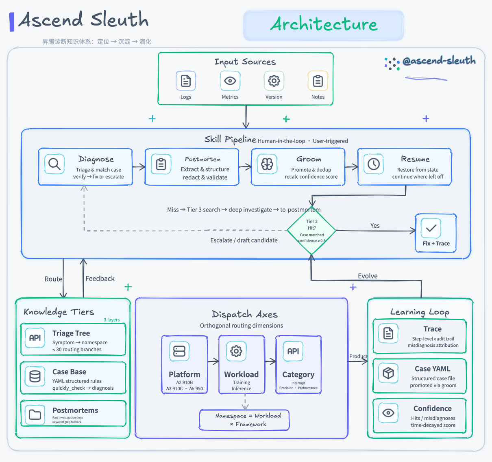

# ascend-sleuth

[](https://www.hiascend.com/)

昇腾（Ascend）训练与推理支持的诊断 skill 套件。把问题定位从个人经验沉淀为团队可复用、可持续演进的知识资产。

遵循 [Agent Skills](https://agentskills.io/) 标准，可在 pi、Claude Code、Codex 等任意支持该标准的 agent 中使用。

## 为什么需要它

昇腾支持工程师每天面对三类问题：训练/推理中断（hang、crash、OOM）、精度异常（loss 发散、FP8 衰减）、性能退化（吞吐下降、通信占比过高）。这些问题的根因高度重复，但知识分散在个人笔记、IM 聊天、各处 wiki 里——新 case 每周新增，A2/A3/A5 平台差异持续扩大，任何依赖单个人手工维护的方案都会在三周内腐化。

ascend-sleuth 用一套可演化的知识库把这些经验结构化：诊断时按症状路由到已验证的 case，定位完自动沉淀成新知识，每周有人维护知识库的去重、退休、置信度。知识越用越准，不依赖任何单个人持续手工维护。

## 安装

```bash
npx skills@latest add pillumina/ascend-sleuth
```

选择要装的 skill 和目标 agent 即可。或在 pi / Claude Code 里手动把 `skills/` 目录加入 skill 搜索路径。

挑核心的装：

```bash
npx skills@latest add pillumina/ascend-sleuth -g -a pi -a claude-code \
  -s diagnose -s to-postmortem -s knowledge-groom
```

加载后在 agent 里以 `/skill:<name>` 调用。

## 包含的 Skills

| Skill | 作用 | 何时用 | 触发 |
|---|---|---|---|
| `diagnose` | 核心诊断循环：症状路由 → 匹配 case → 给 fix（高危根因提示先停服务）或转深度排查；全程写 trace | 训练/推理出现中断、精度、性能问题 | 显式 `/skill:diagnose` |
| `to-postmortem` | 把一次定位沉淀成知识；任意来源（本地 session / Kimi 对话 / 手工笔记）汇入，过语义校验 + 脱敏 | 定位完，无论在哪查的都来这沉淀 | 可自动触发 |
| `knowledge-groom` | 周期维护：升格、校验引用、去重、重算置信度、软退休 | 领域 owner 每周 | 显式 `/skill:knowledge-groom` |
| `resume-diagnosis` | 续接被打断的诊断，读状态文件 + trace 复述现场 | 诊断被会议/上下文压缩打断；多人交接 | 显式 `/skill:resume-diagnosis` |

各 skill 的完整细节（severity 闸门、trace 规则、语义校验等）见对应 `skills/<name>/SKILL.md`。诊断类 skill 设为 user-only——诊断决策要人触发，不让模型自动跑；`to-postmortem` 可自动触发，鼓励沉淀。

## 用法示例

**`diagnose`** — 把客户提供的症状、框架、日志片段告诉 agent（agent 不访问客户环境，信息都你来提供）：

```
/skill:diagnose

客户 A5 (950) 训练在 step ~3000 hang，all_to_all timeout，world_size=128。
框架 mindspeed-llm 2.5.0。报错栈尾：[粘贴相关 rank 的日志片段]
```

agent 路由到 `training/mindspeed-llm/` → 匹配 case → 给结构化结果（CASE-ID + confidence + fix + rollback）或转深度排查。信息不够时主动问你需要向客户要什么。全程写 trace。

**`to-postmortem`** — 沉淀一次定位，输入方式灵活（粘贴 / 文件 / 多文件 / 目录）：

```
/skill:to-postmortem "[粘贴对话或笔记]"                       # 内联
/skill:to-postmortem ~/cases/custA/notes.md                    # 单个文件
/skill:to-postmortem ~/cases/custA/ ~/cases/custB/hang.md      # 多文件
/skill:to-postmortem ~/cases/wiki-export/                      # 目录（批量导入）
```

agent 提取症状/根因 → 给命名空间建议（`[1] training/mindspeed-llm` / `[2] common`），你确认 → 生成 YAML + 脱敏。多文件/目录时批量确认命名空间（一次过），语义校验逐个跑。
也可以不显式调用：`/diagnose` 结束后直接说“沉淀一下这次”，agent 自动触发。

**`resume-diagnosis`** — 诊断被打断后续接：

```
/skill:resume-diagnosis
```

读活跃的 `diagnosis_state-*.yaml`（每个并发诊断一个文件；多个时列出让选），复述上次停在哪步、排除了哪些 case、当前 active case，等你贴回命令输出后继续。

**`knowledge-groom`** — 领域 owner 每周维护知识库：

```
/skill:knowledge-groom
```

扫 `postmortems/` 新增记录 → 升格、校验 references、去重、重算置信度、软退休 → 产出变更摘要交 owner 审（提交由 owner 自己来，不自动开 PR）。


> 架构总览：诊断流水线、三层知识结构、平台分发矩阵、学习闭环。动画版见 [ascend-sleuth.gif](docs/diagrams/ascend-sleuth.gif)。

## 工作原理

知识分三个层次，按需加载，控制上下文消耗：

| 层 | 内容 | 加载时机 |
|---|---|---|
| Tier 1 | `triage-tree.yaml`，症状到命名空间的路由，不超过 30 个分支 | 始终加载 |
| Tier 2 | `knowledge/` 下结构化的 case 规则 | 症状匹配后两阶段加载 |
| Tier 3 | `postmortems/` 原始定位记录 | 前两层未命中时关键词检索兜底 |

问题有两个正交维度，分别由不同机制承载：

- **在哪查**：训推 × 框架，决定加载哪个命名空间（`training/mindspeed-llm/` 等）。这是知识库的目录结构。
- **什么性质**：问题类型（中断 / 精度 / 性能），决定诊断路径和工具。三类各有独立的 quickly_check 形态和默认排查脚本——中断用错误签名 grep，精度用数值阈值断言，性能用 profiler 指标比对。

诊断过程全程记 trace（加载了哪些命名空间、按什么顺序跑了哪些检查），用于事后归因：一次误诊是知识库里的 case 错了，还是 agent 执行流程错了，两者修复路径不同。

## 知识库结构

```
knowledge/
├── training/{mindspeed-llm,mindspeed-mm,verl}/
├── inference/{vllm-ascend,sglang}/
├── common/                  多框架共用的权威记录（由 groom 提升）
├── _archive/                软退休的过期 case
└── platforms/{a2,a3,a5}.md  平台背景知识
triage-tree.yaml             Tier 1 路由
postmortems/                 Tier 3 原始记录
examples/sample-case.yaml    canonical 样例（全 schema 演示）
eval/golden/                 回归测试夹具（公开仓放构造示例；真实 fixture 放私有仓）
docs/eval.md                 skill 改动评估流程
```

**改 skill 本身前**，照 [`docs/eval.md`](docs/eval.md) 跑 golden 回归套件——别把原来能查的查坏了。

**公私分离**：`skills/`、`references/`、`examples/` 是方法论，可以公开。`knowledge/` 和 `postmortems/` 的真实内容含客户日志和集群信息，必须私有。本仓库只含方法论和空脚手架，真实案例应放团队私有仓库。`.gitignore` 已配置好这条边界——即使把真实 case 写进 `knowledge/`，也不会被推到这个公开仓库。

## 日常工作流

```
接到问题 → /skill:diagnose（本地 agent 诊断 + 知识匹配）
  紧急时告诉 agent“这是紧急情况”→ 它先给 stabilize 建议、不钻深度排查
定位完 → /skill:to-postmortem 沉淀
  （无论这次是 /diagnose 诊断的、还是之前用 Kimi/手工查的，都从这里汇入）
被打断 → /skill:resume-diagnosis
领域 owner 每周 → /skill:knowledge-groom
```

诊断时 fix 是 agent 给的建议，由人手动应用到客户环境，agent 不自动改生产。

## 路线图

**v1（已实现）**：trace 与误诊归因、学出的置信度、语义校验、分布式命令参数化、triage 优雅退化、severity 字段。

**v1.5**：非单调版本兼容、agent 自起草候选 case。

**v2**：从 trace 挖掘结构改进分类器、可信自动晋升、跨团队联邦。

## 状态

这是 v1 骨架。结构、schema、triage-tree、一个完整字段的样例 case（`examples/sample-case.yaml`）都已就绪，但 `knowledge/` 是空的——这是诚实的冷启动状态。

下一步：照样例模板手工播种 10 条高频 case（按三类问题覆盖），或批量导入内网 wiki 的历史案例。灌完第一批、跑过一轮真实的 to-postmortem 和 knowledge-groom，再用数据决定 v1.5 机制的上线顺序。
