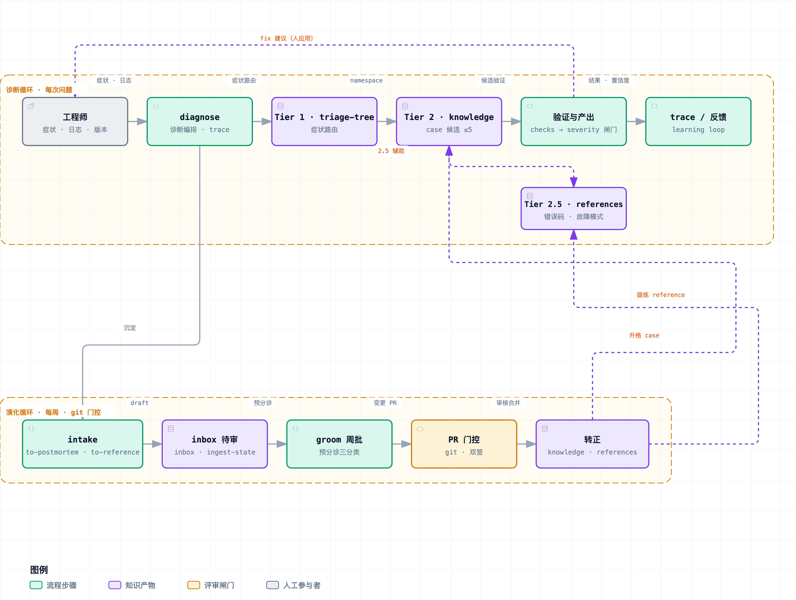
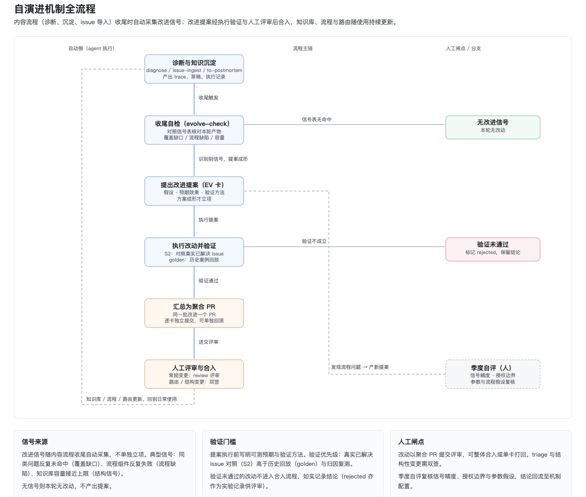

<p align="center">
  <picture>
    <source media="(prefers-color-scheme: dark)" srcset="docs/assets/logo-dark.svg">
    
  </picture>
</p>

<p align="center">
  <a href="https://www.hiascend.com/"></a>
  <a href="https://agentskills.io/"></a>
  <a href="https://opensource.org/licenses/MIT"></a>
</p>

<p align="center">昇腾 NPU 训练与推理问题的诊断知识库。按症状命中已验证的 case，把每次新定位沉淀回库，同类问题下次直接命中。</p>

遵循 [Agent Skills](https://agentskills.io/) 标准，在 pi、Claude Code、Codex、DSH 等支持该标准的 agent 中运行。

## 快速开始

### 安装

1. `git clone` 本仓。DSH 无需额外配置：仓库已跟踪 `.dsh/skills` 链接，`git pull` 更新 SKILL.md 即时生效。
2. 其他 agent 执行一次 `python3 scripts/enable_agent_skills.py`（为已安装的 agent 建项目级 skills 链接，幂等，可重复执行）。
3. 在 agent 中调用 `/skill:<name>`。

Windows 上 Git 默认不还原 symlink，`.dsh/skills` 会变成内容为 `../skills` 的文本文件，agent 发现不了 skills，而 `git status` 此时可能是干净的。自检与两条修法见 [windows-setup.md](docs/guide/windows-setup.md)。

### 使用示例

在 agent 中调用 `/skill:diagnose`，把客户给的症状、框架版本与日志片段粘贴给它：

```
/skill:diagnose

客户 A5-950 训练在 step ~3000 hang，all_to_all timeout，world_size=128。
框架 mindspeed-llm 2.5.0。报错栈尾：
[粘贴相关 rank 的日志片段]
```

agent 按症状路由到 `training/mindspeed-llm/`，匹配并验证 case。命中时输出四段：结论、依据链（含命中的 `<CASE-ID>`、历史 `hits` 与 `misdiagnoses`）、修复方案与 rollback、可靠度与残余风险。未命中时转深度排查。信息不足时，agent 指出还要向客户补什么。

诊断全程写 trace。被打断时可用 `/skill:resume-diagnosis` 续接。

### 在其他项目中试用

```bash
npx skills@latest add pillumina/ascend-sleuth -s diagnose -s to-postmortem -s to-reference -s issue-ingest -s knowledge-groom -s resume-diagnosis
```

该方式安装的是 `skills/` 副本，更新需重新安装，也不沉淀回本仓。要在其他仓库中沉淀知识，按 [知识获取：三种起步形态](docs/guide/knowledge-acquisition.md) 配置。

## 背景

昇腾训练与推理的日常问题集中在三类：中断（hang、crash、OOM）、精度异常（loss 发散、FP8 衰减）、性能退化（吞吐下降、通信占比过高）。根因高度重复，相关知识却散落在个人笔记、IM 聊天与各处 wiki。新 case 每周都在出现，A2-910B / A3-910C / A5-950 三代平台的差异还在扩大，靠个人手工维护的知识库跟不上这个速度。

ascend-sleuth 把这些经验沉淀为结构化知识库。诊断时按症状路由到已验证的 case。定位结束后，新知识进入待审队列，由例行维护完成去重、升格与退休。人工沉淀按周批处理，自动化导入源可以直接升格。

## 工作原理

知识分三层按需加载，控制进 agent 上下文的量：

| 层 | 内容 | 加载时机 |
|---|---|---|
| Tier 1 | `triage-tree.yaml`：症状到命名空间的映射 | 始终加载 |
| Tier 2 | `knowledge/` 下的 case 规则 | 命中症状后两阶段加载：先读该命名空间与类别的读侧视图过滤候选，再加载全文验证 |
| Tier 3 | `postmortems/` 下的原始定位记录 | 前两层未命中时关键词检索 |

知识库本体在 `knowledge/`，按框架与类别分目录：

```
knowledge/
├── _index.yaml / _index/   总表与读侧视图（scripts/build_index.py 生成）
├── training/{mindspeed-llm,mindspeed-mm,verl}/
├── inference/{vllm-ascend,sglang}/
├── common/                 多框架共用的权威记录（由 groom 提升）
└── _archive/               软退休的过期 case
```

命名空间下面按性质分目录（如 `inference/vllm-ascend/interrupt/`）。先验知识层在 `references/`，放官方文档与案例沉淀的事实、工具词条与流程，不参与候选路由。

问题按两个维度拆。在哪查：训练还是推理、用什么框架，决定命名空间（如 `training/mindspeed-llm/`）。什么性质：中断、精度还是性能，决定匹配形态（中断用错误签名 grep，精度用数值阈值断言，性能用 profiler 指标比对），三者不混用。

诊断全程写 trace：加载了哪些命名空间、按什么顺序做了哪些检查、工程师提供了什么证据。误诊归因靠它区分 case 错（改知识 YAML）与执行错（改 skill 正文）。两者的修法不同，混在一起会改坏本来正确的 case。

三个闭环驱动整个系统：

| 闭环 | 什么时候发生 | 入口 | 产出 |
|---|---|---|---|
| 诊断闭环 | 每次问题（分钟级） | `/skill:diagnose` | 修复建议 + trace |
| 沉淀闭环 | 定位结束后 / 定期批量 | `/skill:to-postmortem`、`/skill:to-reference`、`/skill:issue-ingest` | 待审队列 → case / reference 词条 |
| 演进闭环 | 内容流程收尾 / 全库体检轮 | `/skill:evolve-check`、`/skill:self-evolve` | 改进卡 → 验证 → 攒批 PR（人审） |



自演进机制的完整流程（[交互图](docs/diagrams/self-evolve-flow.html)，可切主题与导出 PNG）：



每个机制配了什么护栏、每周实际要做什么，见 [自演进元机制](docs/mechanism/rsi-mechanism.md)。

## 适用范围与限制

- 诊断 agent 不访问客户环境，也不改生产：日志、版本与报错由工程师提供，修复建议由人应用。
- 诊断质量随 agent 变化：prompt 纪律是概率性的，换一个 agent 或换一次会话，结果与 trace 质量可能不同。团队内建议统一 agent。跨 agent 对比时先归因执行差异，再判断是不是知识本身错。
- `data-loss-risk` 的根因不给修复方案，只输出停机、保留现场、通知 owner。
- 版本匹配是软判据：`compat` 不匹配只降 confidence，不排除 case。
- 输出是给人看的建议，不对接 on-call 或 IM 通知链路。

## skill 清单

<!-- BEGIN generated: skill-roster (scripts/build_docs_index.py；由 docs/_manifest.yaml 生成，勿手改) -->
本仓共 **11 个 skill**，按使用场景分 3 组：
- **日常诊断**（2）：`diagnose` · `resume-diagnosis`
- **知识沉淀**（4）：`to-postmortem` · `to-reference` · `issue-ingest` · `reference-ingest`
- **维护与演进**（5）：`knowledge-groom` · `self-evolve` · `evolve-check`（内部协议，由内容流程收尾自动转接，不单独调用） · `skill-review`（内部协议，由用户显式触发做 skill 质量审视） · `preload-panel`（仅 DSH：本机 DSH 有 cordis_define / cordis_run 时热加载面板，否则装常驻插件包）
<!-- END generated: skill-roster -->

每个 skill 的触发条件与操作细节见各自的 `skills/<name>/SKILL.md`。

## 文档

- [文档总目录](docs/README.md)：全部文档按"什么时候读"分层
- [演示走查](docs/demo-walkthrough.md)：从一次诊断到知识演化的完整演示，不需要动手
- [诊断面板](dsh-plugins/ascend-panel/README.md)：DSH 会话中的可视化面板（可选增强）
- [知识获取](docs/guide/knowledge-acquisition.md)：三种起步形态与稀疏拉取白名单
- [部署与协作](docs/guide/git-workflow.md)：集中式与框架式 fork 两种部署、目录归属、审核与门控
- [术语表](CONTEXT.md)：case / postmortem / groom / trace / reference 的规范定义

## 许可

MIT，见 [LICENSE](LICENSE)。
