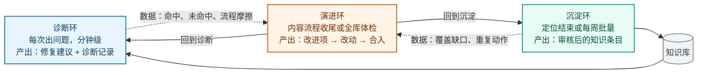
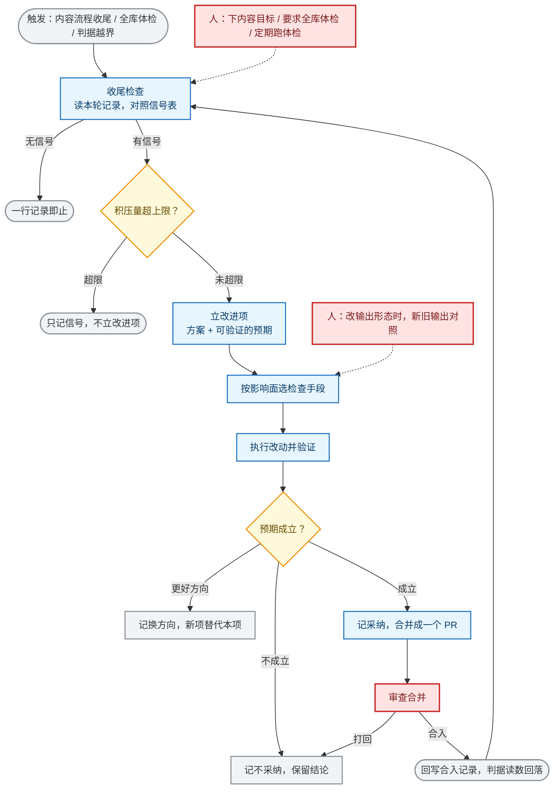

# 自演进机制：设计与实现

> 这是自演进机制的技术说明。看完它你会知道：这套机制怎么运转、哪一步需要人、哪一步已经交给 agent。
> 想看系统整体在做什么，先读 [demo-walkthrough.md](../demo-walkthrough.md)。要改机制本身，再看本文末尾指向的几篇。
>
> 正文不用内部简称。你需要去改脚本、查数据文件时，用 [名词对照](#9-名词对照) 那张表换名字。
> 本文不写会过期的数字：知识库条数现算（`python3 scripts/index_counts.py`），改进项看 `python3 scripts/ev_measure.py --audit`，
> 指标看 `metrics/timeline.yaml`，判据阈值看 `proposals/gates.yaml` 与 `metrics/gates.yaml`。

---

## 1. 这套机制在做什么

系统在干活的过程中顺手改自己，改完的东西下次干活就用得上。

它不需要人单独发起"自我升级"。每次内容工作收尾时，系统自己检查这一轮有没有改进信号。有就记下来、改掉、验证，没有就一行带过。

系统里跑着三条环路。分清它们，是读懂后面所有内容的前提。

| 环路 | 什么时候发生 | 谁发起 | 产出 |
|---|---|---|---|
| 诊断 | 每次出问题，分钟级 | 工程师贴日志 | 修复建议 + 一份诊断记录 |
| 沉淀 | 定位结束，或每周批量导入 | 定位的人，或例行拉取 | 待审草稿，审核后进入知识库 |
| 演进 | 上面两环产生数据之后 | 系统自动，或人显式要求 | 改进项 → 改动 → 验证 → 合并送审 |

三条环路共用一条链：前两条产生数据，演进读数据改机制，改完回落到前两条。链条每一段都要能回答"凭什么说它变好了"，这是第 5 节的内容。

蓝色是诊断，绿色是沉淀，橙色是演进。虚线是交给演进的数据，实线是改完之后的回落。

---

## 2. 什么时候会发生演进

有四个入口。

| 入口 | 谁发起 | 覆盖什么 |
|---|---|---|
| 内容流程收尾时的检查 | 系统自动，不需要人说"改进系统" | 这一轮干活产生的数据：新沉淀、未命中、重复动作、流程摩擦 |
| 每周批审收尾时的检查 | 系统自动 | 知识库的覆盖缺口与结构问题 |
| 人显式要求做一次全库体检 | 人 | 跨轮聚合：归因聚类、容量、重跑未做的条目、指标漂移 |
| 定期体检报出越界的判据 | 人跑一次体检 | 机制自身在腐化：积压、引用腐烂、判据缺失、外部验证停摆 |

第四个入口现在还有人参与，因为没有人固定去读它。判据能报出越界，体检目前挂在每周的例行动作上。这一点在第 6 节展开。

---

## 3. 两处学习

系统在两个层面上更新自己。作用对象不同，速度也不同。

**知识层**：一条知识被用之后，工程师回报修复结果，这条知识的置信度就更新，下次选候选时的顺序随之变化。周期是分钟到天。

**机制层**：干活留下的记录累积起来，系统判断这次出错是知识的问题还是流程的问题，据此改知识库或改流程，结构随之变化。周期是周到季。

知识层的输入来自工程师回报，这条通道目前没有数据，所以命中率、误诊率、校准都只能标注为不可解读。体检器把"零误诊"和"没人回报"分开显示，避免前者被读成结论。这一点在第 8 节列为第一项缺口。

机制层不依赖现场回报。它读的是干活时已经留下的记录：诊断记录、重跑结果、流程摩擦。沉淀上游 issue 这条路线的价值就在这里——那些问题的答案在沉淀时已经拿到手上。

---

## 4. 从触发到落地

### 4.1 主线

全流程的交互图在 [自演进机制全流程](../diagrams/self-evolve-flow.html)（可切主题、可导出 PNG）。下面是同一条线，只标出每一步由谁做。
颜色：蓝框由系统自动执行，黄框是判断点，红框需要人，灰框是终态。

三种终局的比例本身就是一条读数。如果只有采纳和换方向、从来没有不采纳，那么采纳记录不能单独作为质量结论——它说明这个系统缺一种拒绝的出口。外部研究把这件事说得很直接，见第 7 节。

### 4.2 每一步的判据与落点

| 步骤 | 怎么算数 | 数据落在哪 |
|---|---|---|
| 收尾检查 | 有没有触发信号；有没有落收尾记录。"跑了但没有信号"与"根本没跑"必须可区分 | 执行记录（运行时文件，同一个克隆共享） |
| 立改进项 | 每一处都要能追到出处；预期必须写成一条命令加期望值，或者写明为什么不可度量 | 改进项文件（进 git） |
| 执行与验证 | 改哪里就测哪里，按第 5 节选检查手段 | 预期实测记录（运行时文件） |
| 判定 | 改进项是有过程的档案：提出、执行、验证、判断。缺一环算不完整，CI 会报 | 改进项内的追加式决策记录 |
| 合并送审 | 批量的边界明确；每一项独立提交，可以单独撤回 | PR，合入后回写指针 |
| 落地回读 | 回写指针之后，判据读数才是真的 | 判据读数 |

两条不能破的纪律。第一，只有想法、没有可执行方案的，不立改进项。第二，评分口径与指标定义只有人能改，agent 不能改自己的评分标准。

### 4.3 五类演化动作与对应的护栏

演进能改的东西只有五类。每一类都配了护栏，防的是越学越错。

| 动作 | 作用对象 | 什么时候发生 | 护栏 |
|---|---|---|---|
| 置信度校准 | 单条知识的置信度 | 每次收到现场反馈 | 只按已回报的结果回写；同一条连续两次未解决就转人工，防误诊级联 |
| 知识注入 | 知识库条目 | 定位结束，或每周批审 | 人审队列、语义校验、高风险双签，防错误知识入库 |
| 误诊归因 | 知识库或流程 | 每次误诊 | 先读诊断记录判断错在哪一侧，防止在执行出错时误改本来正确的知识 |
| 结构演化 | 目录、路由、容量 | 数据触发，例如容量到上限 | 由数据触发而不是预先规划；改动走高风险双签 |
| 退休与复活 | 活跃索引的成员 | 每周 | 只退休版本过期或长期无效的条目；从没被选中的罕见条目不退休，防止过早删除正确的罕见知识 |

三道护栏适用于全部五类动作。自动化只产出建议和证据，采纳由人执行。升级由数据触发，不按日历排期。对照标准不能由被检查的一方修改。

### 4.4 一次现场反馈的完整数据流

反馈走四个写入点，进不进 git 是分开决定的。

| 写入点 | 写什么 | 进 git | 为什么 |
|---|---|---|---|
| 诊断记录 | 过程，加一条"等待回报结果"的待办 | 否 | 含客户现场信息；定位结束后留在本地 |
| 知识条目 | 置信度：命中、误诊、分数、最近命中 | 是，走知识修改 PR | 这是知识层的持久状态。命中加一必须入库，才能改变下次候选排序 |
| 索引 | 分数 | 是，生成物 | 条目变了就重建索引，随同一个 PR 走，CI 强制同步 |
| 指标源文件 | 每期一条观测 | 是 | 周节奏、人复核：脚本产出骨架，人看过分母再落期 |

每次反馈直接写的是知识条目，那才是知识层的持久状态。指标是周期性的汇总，不等每一次反馈。必须入库不等于每一单都开 PR，结算与入库按周批走一次。

---

## 5. 验证怎么闭环

演进容易停在一句"我觉得改好了"。四层检查把它挡住，从弱到强。

| 层次 | 手段 | 挡住什么 | 谁来判 |
|---|---|---|---|
| 记录不陈旧 | 观测账本进 CI | "改了回归样本而没人重跑"与"跑过了就是这样"的区分 | 机械 |
| 预期可复现 | 改进项里的一条命令加期望值 | 只写在文字里、无法证伪的改进 | 机械，任何评审一条命令就能复核 |
| 前后无回归 | 改前改后对照 | 改坏了原来能命中的场景 | 机械 |
| 对照标准不可自改 | 冻结的对照样本按内容哈希固定 | 同一双手既改被测对象、也改对照标准 | 机械，加人。谁能重新冻结这一层目前只有标记可见，见第 6 节 |

检查必须能报错才算检查。一个从来没红过的检查，和没有检查，在观测上分不出来。所以硬性检查都配了负例断言：故意改坏被检查的东西，看它会不会报错。闭环演练脚本逐条做这件事。这条也是外部研究给出的准入标准。

已知的例外：体检器的那几条判据还没有负例断言。它们现在是绿的，但没有证据证明它们红得起来。这是第 8 节的第 2 项。

数据源缺席时，判据说"判不了"，不写 0 冒充满分。所以体检器的退出码是三态：全部评过且无越界、有判据被违反、有判据没被评估。这样"没触发"和"没检查过"不会混在一起。

---

## 6. 哪一步需要人，哪一步可以交给 agent

这一节回答"哪些地方以后不用我管"。

下表的"可退出条件"写的是：缺什么才能把这一步交给 agent。条件都可以核对。

| 步骤 | 现在谁做 | 为什么现在是人在做 | 可退出条件 | 判定 |
|---|---|---|---|---|
| 发起全库体检 | 人 | 系统不知道业务上现在该关心什么。全库体检这一项关掉了自动发起 | 需要不依赖人的触发源。判据越界已经能机械读出来，缺的是固定去读它的动作 | 部分可退 |
| 立改进项、执行、验证、判采纳 | agent | — | — | 已交给 agent |
| 审查合并 | 人 | 当一项的验证出自自定口径时，评审是仅有的外部约束 | 这个面有能报错的硬性检查，并且预期由外部来源判定 | 部分可退：有硬性检查的面可退，只能自己证明自己的面不能 |
| 结构性改动：骨架、路由、新 skill 立项 | 两人双签 | 影响面无法局部验证 | 无。设计上不由 agent 单独决定 | 不可退 |
| 重新冻结对照样本 | 维护者 | 对照标准不能由被检查的一方改 | 把对照标准交给独立的第二方持有；代码所有者机制落实后即可。注意受益人是换个持有人，不是 agent | 可退，换持有人 |
| 指标口径与评分定义 | 人 | 系统不改自己的评分标准 | 无 | 不可退 |
| 指标源文件落期，复核分母 | 人 | 分母为 0 时读数会被读成没问题 | 现场反馈通道有自动化替代。目前没有 | 现在不可退 |
| 现场反馈回报 | 工程师 | 只有工程师能回答"修复在你的环境里解决了没有" | 没有机械替代。外部对照只能回答内容对不对，回答不了现场解不解决；严重性语义和环境特异性只认现场 | 不可退 |
| 触发信号表的维护 | owner | 实测表与真实信号族脱钩，多数改进项落不进设计表 | 先要决定是扩表覆盖真实信号族，还是收窄行为、把表外信号归一 | 待决策 |

**发起体检**这一项的具体形态：体检器已经能报出哪条判据被违反、该做什么动作，缺的是固定去读它的动作。可以把它挂到已有的收尾动作上，让判据越界本身成为一个触发入口。前提是先有一条能报错的判据——报不出问题的体检器，自动跑起来也只会安静地绿。

---

## 7. 外部依据

下表把外部研究本仓库对应的设计对上。出处都是公开论文，调研物料在仓库外的本地目录，不进文档体系。

| 外部研究 | 它证明了什么 | 本仓库对应的设计 |
|---|---|---|
| [Knowledge-Centric Self-Improvement](https://arxiv.org/abs/2607.19592) | 自我改进的持久对象应当是受治理的知识库，不是 agent。这样的改进可审、可迁移，能迁到未见任务和不同模型家族 | 知识库是资产、agent 可弃这条总的论题；三级知识与 skill 自包含 |
| [RSEA](https://arxiv.org/abs/2606.28374) | 在独立对照集上严格更好才留下，是递归自演化保持单调安全的条件。对照的无检查在线策展：一个基准接近最优，另一个崩到 0.14 | 冻结对照样本按内容哈希固定；此前通过的不许变为失败 |
| [PACE](https://arxiv.org/abs/2606.08106) | 短板在接受规则，不在提出方案的一方。分数涨了就收，重复多次相当于对自己做多重检验；有真改进时也有三到四成的假接受 | 对照评分改成同批题配对比较加复用折减；判定三态，只有接受算通过 |
| [Ratchet](https://arxiv.org/abs/2605.22148) | 判定器把失败误判为通过时，任何样本量都退不掉一条坏知识。自写内容的增益接近 0，人写的增益显著为正 | 来源自报与独立命中分开计数 |
| [Library Drift](https://arxiv.org/abs/2605.19576) | 不维护的知识库会漂移到"注入了反而更差"。过早退休同样有害 | 命名空间容量上限、软退休；罕见但正确的条目不退休 |
| [StarHarness](https://arxiv.org/abs/2608.24804) | 把演化用的样本分成三方：方案方可见、对方案方隐藏、另留泛化，增益在被排除出演化过程的任务上仍然保持 | 候选样本与冻结对照样本分离；对方案方隐蔽的选样集等池子规模达标后再评估 |
| [Falsifiable Release Gates](https://arxiv.org/abs/2607.13070) | 不能报错的检查与没有检查在观测上不可区分。作者要求故意弄坏被检查对象，看检查器会不会给出最短反例 | 闭环演练里的负例断言：改冻结样本必红、删除必红、重新冻结需打标签 |
| [大 skill 库检索比较](https://arxiv.org/abs/2608.06196) | 用关系图或嵌入替换词法召回会显著更差。作者自己写的查询会把命中率高估最多 44 点 | 检索不上向量库；评测查询必须来自真实记录 |
| [Agent Skills Can Be Harmful](https://arxiv.org/abs/2608.11888) / [SkillsBench](https://arxiv.org/abs/2602.12670) | 更大更全的 skill 反而更差。最大的效率退化来源是过度验证，也就是把验收清单变成必须执行的工作 | skill 保持聚焦、行为规则内联；判断性规范不硬化成 CI 检查 |
| [Safe Harness Self-Evolution](https://arxiv.org/abs/2609.08175) | 生成与认证是两个不同的约束。评估受限时，多产候选并不提高成功更新的保证 | 不以改进项数量作为进度指标；积压量超上限即停产新项 |

这张表里的结论是背书与准入标准，不能直接照搬。外部系统的对象和数据规模与这里不同。每一条落到本仓库都经过一次合不合用的判断，判断结果与落地状态记在调研物料里，被否决的替代方案记在 `adr/`。

---

## 8. 已知缺口

按危害排序。每条都带能自己核对的判据。

1. **知识层的输入是空的**。现场反馈回报通道没有数据。
   判据：指标体检器把命中率、误诊率、校准一律标成不可解读，它由现场反馈捕获计数驱动，计数为 0 时它拒绝下"无异常"的结论。
   补它的动作不在机制侧，在让真实工程师跑完一次诊断并回报结果。

2. **体检器的判据没有被证明会报错**。闭环演练对冻结样本、改进项规则、执行记录都有负例断言，体检器的那几条判据一条都没有。它们现在绿，不代表它们红得起来。

3. **外部验证还没有产出第一条独立记录**。通道已经建好，选样纪律也写清楚了（样本既不能是这条知识的来源，也不能在这条知识的正文里被引用），但至今没有一条"另一个现场撞上同一条知识"的独立验证。

4. **对照样本集的规模不够做判定**。池子小到配对检验够不到判定线，实测结论只能落在证据不足。它是验证样本通道，不是判定池。

5. **触发信号表与真实信号族脱钩**。多数改进项落不进设计表。改进项没有写错名字：这张表既不是枚举，也没有覆盖真实的触发空间。属于设计决策，等 owner 定扩表还是收窄行为。

6. **判据阈值都是没校准过的估计**。越界线的数值是估计值，标注为接受实测重校，还没有一条被实测校准过。所以全部绿只证明没有越过猜出来的线，不证明线画在对的地方。

7. **部分评测面没有判据**。性能类问题的数值断言、平台键控分支、修复正确性、严重性行为（高危不给修法）这几面目前没有自动判定。判据：冻结对照样本的覆盖报告会报出"有知识却没有样本"的格子。

---

## 9. 名词对照

正文用白话。你要去改脚本、查数据文件时，用这张表换成实际名字。

| 正文里说 | 代码与文件里的名字 |
|---|---|
| 改进项 | `proposals/ideas/` 下的卡 |
| 收尾检查 | `evolve-check` |
| 全库体检轮 | `self-evolve` |
| 判据、体检器 | `proposals/gates.yaml`、`scripts/evolution_health.py`、`metrics/gates.yaml`、`scripts/metrics_health.py` |
| 积压量 | 水位读数，`scripts/ev_proposal.py --waterline` |
| 回写合入指针 | `scripts/ev_proposal.py --mark-merged` |
| 回归样本 | golden fixture，`eval/golden/` |
| 冻结的对照样本 | holdout，`eval/holdout.yaml` |
| 对照样本集 | arena 池，`eval_arena.py --stats/--gate` |
| 用历史问题重跑 | S2 issue-replay，`scripts/s2_replay.py` |
| 预期可复现 | `predicted_effect.measure`，`scripts/ev_measure.py` |
| 诊断记录 | trace，`traces/<session>.yaml` |
| 现场反馈回报 | 反馈通道 S1，`case.confidence` |
| 内容与外部结论对照 | 反馈通道 S2，`case.validation_record` |
| 每周批审 | `knowledge-groom` |
| 先筛摘要再读正文 | 两阶段加载，Tier 2 索引分片 |

---

## 10. 每周做什么

| 节奏 | 动作 | 命令或入口 | 产物 |
|---|---|---|---|
| 每次诊断后 | 回报修复结果。下次诊断启动时会追问，不另开审讯 | 回答诊断流程的追问 | 该条知识的置信度更新 |
| 定位结束后 | 沉淀知识 | `/skill:to-postmortem`、`/skill:to-reference` | 待审草稿 |
| 内容流程收尾 | 收尾检查。有信号才立改进项，没有就一行带过 | `/skill:evolve-check` | 改进项，或一行无信号记录 |
| 每周 | 批处理待审队列、升格、去重、退休、重建索引 | `/skill:knowledge-groom` | 知识变更 PR |
| 每周 | 产出指标快照并落一期。任何人跑周批时都可做 | `python3 scripts/metrics_snapshot.py --kind live`，人复核后写 `metrics/timeline.d/`，再跑 `build_timeline.py` 与 `metrics_health.py` | 一个期号源文件，加重建后的时序数据 |
| 每周 | 批量拉取上游 issue | `/skill:issue-ingest` | 待审草稿与导入游标 |
| 每周 | 跑一次体检 | `python3 scripts/evolution_health.py` | 逐条判据的结果与下一步动作 |
| 随时 | 评审一项改进 | `python3 scripts/ev_measure.py <项号> --run` | 符合、被证伪、无法判定 |
| 全库体检时 | 深度观测轮 | `/skill:self-evolve` | 改进项与合并 PR |
| 每季度 | 复核判据阈值与就绪度 | [roadmap.md](../plan/roadmap.md)、[rollout-assessment.md](../plan/rollout-assessment.md) | 阈值修正 |

先看体检器再下结论。没有它，零误诊和没人回报看起来是一样的。

---

## 11. 改机制时读哪篇

一件事只有一个权威处，其余文档都是引用。

| 你要做的事 | 读哪篇 |
|---|---|
| 判断某个设计或改动是否合规 | [design-principles.md](../spec/design-principles.md) |
| 写给人看或给人审的文本 | [writing-norms.md](../spec/writing-norms.md) |
| 改一个流程的行为 | `skills/<name>/SKILL.md`。流程必须自包含，不依赖 docs/ |
| 改测评检查、跑回归 | [eval.md](../guide/eval.md) |
| 走 PR、门控、多人协作 | [git-workflow.md](../guide/git-workflow.md) |
| 看指标口径、跑周批 | [metrics.md](../guide/metrics.md) |
| 查"演进闭环自己健不健康"的判据定义 | [pipeline.md](pipeline.md) 第 7 节 |
| 改演进机制本身 | [pipeline.md](pipeline.md) 状态机与卡 schema、[execution.md](execution.md) 信息契约与验证、[orchestration.md](orchestration.md) 会话与预算、[run.md](run.md) 持续运行 |
| 做评测机制 | [eval-arena.md](eval-arena.md)、[ixn-replay.md](ixn-replay.md) |
| 排下一步工作、评估能否推广 | [roadmap.md](../plan/roadmap.md)、[rollout-assessment.md](../plan/rollout-assessment.md) |
| 查当初为什么这样选 | `adr/` |

内部记账号只在各自的计划文档里使用。机制文档、PR 说明、改进项正文要引用就写中文含义，规则见 [glossary.yaml](../glossary.yaml) 的生存范围字段。

改机制之前先读 [design-principles.md](../spec/design-principles.md) 与 [eval.md](../guide/eval.md)：前者是条文的来源，后者写清了改哪里测哪里的规矩。
