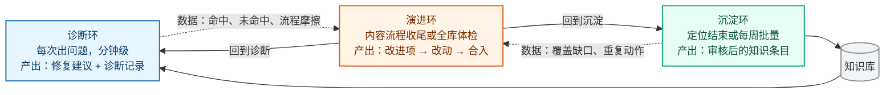
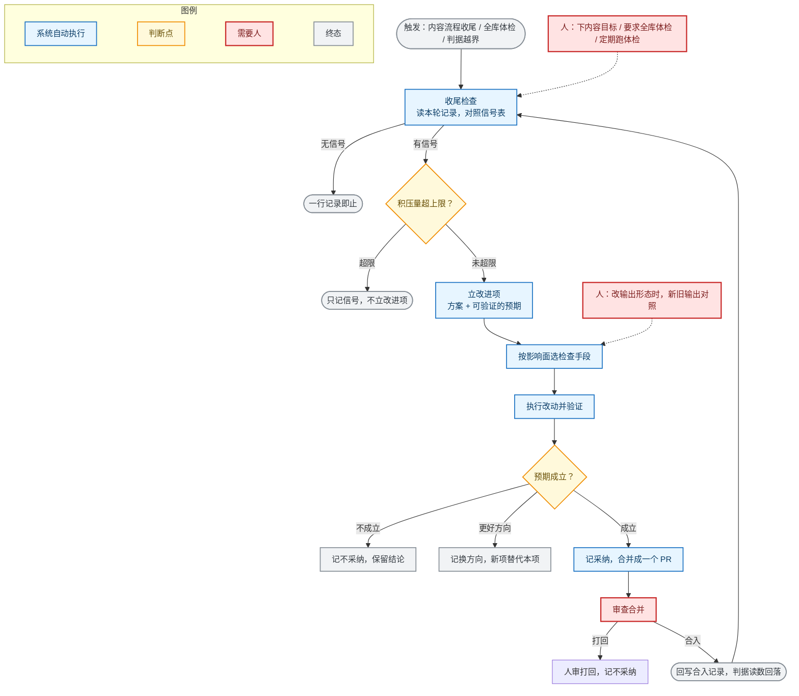

# 自演进机制：设计与实现

系统在做内容工作的过程中改自己，改出来的东西在下一轮工作中生效。本文是这套元机制的技术说明，也是它唯一的技术入口，覆盖三件事：这套机制怎么运转、哪一步需要人、哪一步可以交给 agent。

为什么值得读：要改这套机制本身，先要分清三条环路与两个学习层面分别落在哪，否则一处改动会挡到另一处。

范围：本文覆盖机制怎么运转、哪一步需要人、数据落在哪、验证怎么闭环、现状与缺口。不含单个流程内部的执行规则（`skills/<name>/SKILL.md`）、演进流水线的状态机与卡 schema（[pipeline.md](pipeline.md)）、评测池与交互面评测的口径（[eval-arena.md](eval-arena.md)、[ixn-replay.md](ixn-replay.md)）。

读者与前置：先读 [demo-walkthrough.md](../demo-walkthrough.md)，它能说清系统整体在做什么。正文不用内部简称；改脚本、查数据文件之前，先用第 11 节的[代码与文档入口](#11-代码与文档入口)把正文用词换成代码与文件里的名字。本文不写会过期的数字，需要时现算：知识库条数用 `python3 scripts/index_counts.py`，改进项状态用 `python3 scripts/ev_measure.py --audit`，指标读 `metrics/timeline.yaml`，判据阈值读 `proposals/gates.yaml` 与 `metrics/gates.yaml`。

何时不必读：只想知道系统整体在做什么的人读 [demo-walkthrough.md](../demo-walkthrough.md) 即可；按现有流程跑日常诊断与沉淀的人不必读本文。要改机制本身，先看第 13 节的权威归属表，它说明每件事由哪篇文档说了算。

---

## 1 解决什么问题

系统在做内容工作的过程中改自己，改出来的东西在下一轮工作中生效：修复结果回写单条知识的置信度，内容工作留下的记录攒成对知识库与流程的改动。

演进不需要人单独发起。每次内容工作收尾时，系统检查这一轮有没有改进信号。改进项是 `proposals/ideas/` 下的一张卡，记方案、可验证的预期、判定结果。有信号就记录、立改进项、执行、验证；没有信号只留一行记录。每周批审收尾时同样自动检查一轮。另外两个入口（人显式要求的全库体检、体检报出的判据越界）仍要人触发，原因见第 2 节末，退出条件见第 6 节。

系统里有三条环路，区分它们是读懂后文的前提。

| 环路 | 什么时候发生 | 谁发起 | 产出 |
|---|---|---|---|
| 诊断 | 每次出问题，分钟级 | 工程师贴日志 | 修复建议 + 一份诊断记录 |
| 沉淀 | 定位结束，或每周批量导入 | 定位的人，或例行拉取 | 待审草稿，审核后进入知识库 |
| 演进 | 上面两环产生数据之后 | 系统自动，或人显式要求 | 改进项 → 改动 → 验证 → 合并送审 |

三条环路构成一个闭环：诊断环与沉淀环产生数据，演进环读数据改机制，改完的结果回到前两环。这个闭环的每一段都要能给出可核对的改进证据，见第 5 节。

**图 1　三环闭环（类型：流程图；范围：诊断、沉淀、演进三条环路与知识库之间的数据流向）**

```mermaid
%%{init: {'themeVariables':{'fontSize':'14px'},'flowchart':{'curve':'basis','nodeSpacing':40,'rankSpacing':50,'padding':10}}}%%
flowchart LR
    DX["诊断环<br/>每次出问题，分钟级<br/>产出：修复建议 + 诊断记录"]
    CJ["沉淀环<br/>定位结束或每周批量<br/>产出：审核后的知识条目"]
    YJ["演进环<br/>内容流程收尾或全库体检<br/>产出：改进项 → 改动 → 合入"]
    KB[("知识库")]
    DX -.->|"数据：命中、未命中、流程摩擦"| YJ
    CJ -.->|"数据：覆盖缺口、重复动作"| YJ
    YJ -->|"回到诊断"| DX
    YJ -->|"回到沉淀"| CJ
    CJ --> KB
    KB --> DX

    classDef dx fill:#e7f5ff,stroke:#1971c2,stroke-width:1.5px,color:#0b3d66
    classDef cj fill:#e6fcf5,stroke:#0ca678,stroke-width:1.5px,color:#0b4f3a
    classDef yj fill:#fff4e6,stroke:#e8590c,stroke-width:1.5px,color:#7a2e00
    classDef store fill:#f1f3f5,stroke:#868e96,stroke-width:1.5px,color:#343a40
    class DX dx
    class CJ cj
    class YJ yj
    class KB store
```

图例：蓝色是诊断，绿色是沉淀，橙色是演进，灰色是知识库。虚线是交给演进的数据，实线是改完之后的回落。

这张图里值得注意的地方：演进环不直接写知识库，它读两个环交来的数据、改机制，再把改动回落到两个环；知识库由沉淀环写入、被诊断环读取，闭环因此不经过人的手工转抄。

明确不解决的问题：本文的机制不改诊断与沉淀两个环内部的执行规则，那些规则在各自的 skill 正文里；它也不替人判断业务上现在该关心什么，全库体检的发起因此留在人手里（第 6 节第 1 行）。

---

## 2 什么时候会发生演进

演进有四个入口。前两个由系统自动触发，后两个由人跑一次体检触发。

| 入口 | 谁发起 | 覆盖什么 |
|---|---|---|
| 内容流程收尾时的检查 | 系统自动，不需要人说改进系统 | 这一轮工作产生的数据：新沉淀、未命中、重复动作、流程摩擦 |
| 每周批审收尾时的检查 | 系统自动 | 知识库的覆盖缺口与结构问题 |
| 人显式要求做一次全库体检 | 人 | 跨轮聚合：归因聚类、容量、重跑未做的条目、指标漂移 |
| 周期性体检报出的判据越界 | 人跑一次体检 | 机制自身的读数越界：改进项积压、引用失效、判据缺失、外部验证停摆 |

第四个入口目前仍由人触发：判据越界能报出来，但还没有固定动作去读它，体检眼下挂在每周的例行工作里。这个入口的退出条件见第 6 节。

---

## 3 最小可执行模型：两处学习与一条改进项链路

读懂这套机制只需要抓住一件事：系统在两个层面上更新自己，两个层面的作用对象与周期都不同。

知识层更新单条知识的置信度。一条知识被使用后，工程师回报修复结果，该条知识的置信度随之更新，下一次选候选时的顺序也跟着变化。这一层的周期是分钟到天。

机制层改知识库或改流程。内容工作留下的记录累积起来后，系统判断这次的错在知识还是流程上，据此改动，结构随之变化。这一层的周期是周到季。

知识层的输入来自工程师回报，而这条通道目前没有数据，因此命中率、误诊率、校准都只能标为不可解读。体检器把零误诊与无人回报分开显示，避免把前者读成结论。这是第 8 节第 1 项缺口。

机制层不依赖现场回报，它读的是工作过程中已经留下的记录：诊断记录、重放结果、流程摩擦。上游 issue 沉淀这条路线因此有价值：这些问题的答案在沉淀时已经拿到。

最小链路是一条改进项的完整生命周期：收尾检查留下信号，立改进项，写下可验证的预期，执行改动、验证结果，判定采纳、换方向还是不采纳，合并送审后回写合入记录。这条链路的每一步在第 4 节展开，护栏在第 4.3 节。演进能改的对象只有五类：置信度、知识条目、知识库或流程、目录路由与容量、活跃索引的成员。

---

## 4 从触发到落地

本节先给主线与每一步的判据落点，再分解五类演化动作，最后一节跟一次现场反馈的数据流。

### 4.1 主线

全流程的交互图在 [自演进机制全流程](../diagrams/self-evolve-flow.html)（可切主题、可导出 PNG）。下面是同一条线，只标出每一步的执行者。颜色约定：蓝框由系统自动执行，黄框是判断点，红框需要人，灰框是终态。

**图 2　自演进主线（类型：流程图；范围：从触发到回写合入记录的步骤、判断点与执行者）**

```mermaid
%%{init: {'themeVariables':{'fontSize':'14px'},'flowchart':{'curve':'basis','nodeSpacing':40,'rankSpacing':46,'padding':10}}}%%
flowchart TD
    T(["触发：内容流程收尾 / 全库体检 / 判据越界"]) --> A1["收尾检查<br/>读本轮记录，对照信号表"]
    A1 -->|无信号| Z1(["一行记录即止"])
    A1 -->|有信号| Q2{"积压量超上限？"}
    Q2 -->|超限| Z2(["只记信号，不立改进项"])
    Q2 -->|未超限| A4["立改进项<br/>方案 + 可验证的预期"]
    A4 --> A5["按影响面选检查手段"] --> A6["执行改动并验证"] --> Q3{"预期成立？"}
    Q3 -->|不成立| Z3["记不采纳，保留结论"]
    Q3 -->|更好方向| Z4["记换方向，新项替代本项"]
    Q3 -->|成立| A11["记采纳，合并成一个 PR"]
    A11 --> M3["审查合并"]
    M3 -->|打回| Z5["人审打回，记不采纳"]
    M3 -->|合入| DONE(["回写合入记录，判据读数回落"]) --> A1
    M1["人：下内容目标 / 要求全库体检 / 定期跑体检"] -.-> A1
    M2["人：改输出形态时，新旧输出对照"] -.-> A5

    subgraph LEG["图例"]
        direction LR
        L1["系统自动执行"]:::auto ~~~ L2["判断点"]:::dec ~~~ L3["需要人"]:::human ~~~ L4["终态"]:::term
    end

    classDef auto fill:#e7f5ff,stroke:#1971c2,stroke-width:1.5px,color:#0b3d66
    classDef dec fill:#fff9db,stroke:#f08c00,stroke-width:1.5px,color:#664d03
    classDef human fill:#ffe3e3,stroke:#c92a2a,stroke-width:2px,color:#7a1c1c
    classDef term fill:#f1f3f5,stroke:#868e96,stroke-width:1.5px,color:#343a40
    class A1,A4,A5,A6,A11 auto
    class Q2,Q3 dec
    class M1,M2,M3 human
    class T,Z1,Z2,Z3,Z4,DONE term
```

图例：蓝框是系统自动执行，黄框是判断点，红框是需要人，灰框是终态。

这张图里值得注意的地方：自动化步骤（蓝）都要过一个判断点（黄）才落终态（灰），判断本身不交给执行方；人只出现在三个位置，给收尾检查下目标或要求体检、改输出形态时做新旧对照、审查合并；触发点与终态同为灰框，回写合入记录后回到收尾检查，所以判据读数反映的是已合入的实现。

三种终局是采纳、换方向与不采纳，它们的比例本身就是一条读数。如果采纳与换方向都有、不采纳一次都没有出现过，那么采纳记录不能单独用作质量结论：它说明系统缺少拒绝的路径。外部研究对这一点有直接结论，见第 13 节的 PACE 一行。

### 4.2 每一步的判据与落点

| 步骤 | 怎么算数 | 数据落在哪 |
|---|---|---|
| 收尾检查 | 有没有触发信号、收尾记录有没有落。跑了但没有信号与根本没跑必须可区分 | 执行记录（运行时文件，同一个克隆共享） |
| 立改进项 | 每一处都要能追到出处；预期必须写成一条命令加期望值，或者写明为什么不可度量 | 改进项文件（进 git） |
| 执行与验证 | 改哪里就测哪里，检查手段按第 5 节选 | 预期实测记录（运行时文件） |
| 判定 | 改进项是一条有过程的档案：提出、执行、验证、判断。缺一环就是记录不完整，CI 会报错 | 改进项内的追加式决策记录 |
| 合并送审 | 批量的边界明确；每一项独立提交，可以单独撤回 | PR，合入后回写指针 |
| 落地回读 | 回写指针之后，判据读数才反映已合入的实现 | 判据读数 |

两条纪律不能违反。只有想法、没有可执行方案的不立改进项。评分口径与指标定义只有人能改，agent 不能改自己的评分标准。

### 4.3 五类演化动作与对应的护栏

演进能改的对象只有五类，每一类都配了护栏，防止改动引入退化。

| 动作 | 作用对象 | 什么时候发生 | 护栏 |
|---|---|---|---|
| 置信度校准 | 单条知识的置信度 | 每次收到现场反馈（该通道目前没有数据，见第 8 节第 1 项） | 只按已回报的结果回写；同一条连续两次未解决就转人工，防误诊级联 |
| 知识注入 | 知识库条目 | 定位结束，或每周批审 | 人审队列、语义校验、高风险双签，防错误知识入库 |
| 误诊归因 | 知识库或流程 | 每次误诊 | 先读诊断记录判断错在哪一侧，防止在执行出错时误改本来正确的知识 |
| 结构演化 | 目录、路由、容量 | 数据触发，例如容量到上限 | 由数据触发而不是预先规划；改动走高风险双签 |
| 退休与复活 | 活跃索引的成员 | 每周 | 只退休版本过期或长期无效的条目；从没被选中的罕见条目不退休，防止过早删除正确的罕见知识 |

另有三条护栏适用于全部五类动作：

- 自动化只产出建议与证据，采纳由人执行。
- 升级由数据触发，不按日历排期。
- 对照标准不能由被检查的一方修改。

### 4.4 一次现场反馈的完整数据流

一次反馈涉及四个写入点，每个写入点是否进 git 单独决定。

| 写入点 | 写什么 | 进 git | 为什么 |
|---|---|---|---|
| 诊断记录 | 过程，加一条等待回报结果的待办 | 否 | 含客户现场信息；定位结束后留在本地 |
| 知识条目 | 置信度：命中、误诊、分数、最近命中 | 是，走知识修改 PR | 这是知识层的持久状态。命中加一必须入库，才能改变下次候选排序 |
| 索引 | 分数 | 是，生成物 | 条目变了就重建索引，随同一个 PR 走，CI 强制同步 |
| 指标源文件 | 每期一条观测 | 是 | 周节奏、人复核：脚本产出骨架，人看过分母再落期 |

反馈直接写入的是知识条目，它是知识层的持久状态。指标文件是周期性汇总，不随每次反馈写入。必须入库不等于每一单都开 PR：结算与入库按周批量处理一次。

---

## 5 验证怎么闭环

演进的结论容易停在没有证据的判断上。下面四层检查从弱到强，逐层挡住这类结论。

| 层次 | 手段 | 挡住什么 | 谁来判 |
|---|---|---|---|
| 记录不陈旧 | 观测账本进 CI（`scripts/eval_scorecard.py --check`，账本记回归样本跑过什么） | 回归样本改了而账本没重建，被读成已经跑过 | 机械 |
| 预期可复现 | 改进项里的一条命令加期望值 | 只写在文字里、无法证伪的改进 | 机械，任何评审一条命令就能复核 |
| 前后无回归 | 改前改后对照 | 改坏了原来能命中的场景 | 机械 |
| 对照标准不可自改 | 冻结的对照样本按内容哈希固定 | 同一方既改被测对象又改对照标准 | 机械判定；重新冻结仍需人，见第 6 节 |

检查必须能报错才算检查。从来没红过的检查与没有检查在观测上无法区分。硬性检查因此都配了负例断言：故意改坏被检查的对象，看检查是否报错。这些断言由 `scripts/rehearse_evolve_loop.py` 逐条执行。这条准入标准来自外部研究，见第 13 节的 Falsifiable Release Gates 一行。

已知例外是体检器的判据：它们还没有负例断言，现在通过，但没有证据表明它们能报错。这是第 8 节第 2 项。

数据源缺席时，判据只报无法判定，不写 0 当作满分。体检器带 `--check` 时退出码分三态：0 表示判据全部评过且无越界，1 表示有判据被违反，2 表示有判据未被评估；不带 `--check` 时退出码恒为 0。这样没触发与没检查过不会混在一起。

---

## 6 哪一步需要人，哪一步可以交给 agent

本节回答哪些步骤以后不需要人做。下表「可退出条件」一列写的是：还缺什么才能把这一步交给 agent。该列的条件都可以核对。

| 步骤 | 现在谁做 | 为什么现在是人在做 | 可退出条件 | 判定 |
|---|---|---|---|---|
| 发起全库体检 | 人 | 系统不知道业务上现在该关心什么；全库体检的自动发起已关掉 | 需要不依赖人的触发源。判据越界已经能机械读出来，缺的是固定去读它的动作 | 部分可退 |
| 立改进项、执行、验证、判采纳 | agent | — | — | 已交给 agent |
| 审查合并 | 人 | 当一项的验证出自自定口径时，评审是仅有的外部约束 | 这个面有能报错的硬性检查，并且预期由外部来源判定 | 部分可退：有硬性检查的面可退，只能自证的面不能退出 |
| 结构性改动：骨架、路由、新 skill 立项 | 两人双签 | 影响面无法局部验证 | 无。设计上不由 agent 单独决定 | 不可退 |
| 重新冻结对照样本 | 维护者 | 对照标准不能由被检查的一方改 | 把对照标准交给独立的第二方持有；代码所有者机制落实后即可退出，退出后由第二方持有，不是交给 agent | 可退，换持有人 |
| 指标口径与评分定义 | 人 | 系统不改自己的评分标准 | 无 | 不可退 |
| 指标源文件落期，复核分母 | 人 | 分母为 0 时读数会被读成没有问题 | 需要现场反馈通道的自动化替代，目前没有 | 现在不可退 |
| 现场反馈回报 | 工程师 | 只有工程师知道修复在自己的环境里是否生效 | 没有机械替代：外部对照只能判断内容对不对，判断不了现场是否解决；严重性语义与环境特异性只有现场能提供 | 不可退 |
| 触发信号表的维护 | 维护者 | 实测表与真实信号族脱钩，多数改进项落不进设计表 | 先要决定是扩表覆盖真实信号族，还是收窄行为、把表外信号归一 | 待决策 |

发起体检缺的是固定去读判据的动作：体检器能报出哪条判据被违反、该执行什么动作，但没有东西定期调用它。可以把体检挂到已有的收尾动作上，让判据越界本身成为触发入口。前提是判据本身能报错：报不出问题的体检器，自动运行也不会产生信号。

---

## 7 边界与失败模式

机制在缺输入、失败与重复面前的行为集中在本节：能判的判，不能判的报无法判定，不拿 0 或通过顶替。每一条的细节在表里指出的节号。

| 情形 | 机制的行为 | 细则 |
|---|---|---|
| 现场反馈通道没有数据 | 命中率、误诊率、校准一律标成不可解读；捕获计数为 0 时拒绝给出无异常的结论 | 第 8 节第 1 条 |
| 判据没有数据源 | 只报无法判定，不写 0 当作满分 | 第 5 节 |
| 体检器有判据未被评估 | `--check` 的退出码为 2，结论不可用 | 第 5 节 |
| 一项预测无法度量 | 声明不可度量是合法退化路径，计为无法判定，不冒充通过 | 第 4.2 节 |
| 判据点到的仓库文件已蒸发 | 该项预测计为无法判定，不把噪声当信号 | 第 4.2 节 |
| 某个评测面没有判据 | 冻结对照样本的覆盖报告报出有知识却没有样本的格子 | 第 8 节第 7 条 |
| 触发信号表与真实信号族脱钩 | 多数改进项落不进设计表，改表这件事留给维护者决定 | 第 8 节第 5 条 |
| 阈值是未校准的估计 | 越界线按估计值执行，全部通过只证明没有越过猜出来的线 | 第 8 节第 6 条 |

| 情形 | 机制的行为 | 细则 |
|---|---|---|
| 收尾检查跑了但没有信号 | 留一行记录，与根本没跑可区分 | 第 4.2 节 |
| 改进项积压量超上限 | 只记信号，不立新项，停产 | 第 4.1 节、第 13 节 Safe Harness Self-Evolution 一行 |
| 预期不成立 | 记不采纳，保留结论 | 第 4.1 节 |
| 验证过程中出现更好的方向 | 记换方向，新项替代本项 | 第 4.1 节 |
| 人审打回 | 记不采纳 | 第 4.1 节 |
| 同一条知识连续两次未解决 | 转人工，防误诊级联 | 第 4.3 节 |
| 检查从来没红过 | 与没有检查在观测上无法区分；硬性检查都配负例断言 | 第 5 节 |
| 同一轮反馈要多次写入 | 反馈直接写知识条目；结算与入库按周批量处理一次 | 第 4.4 节 |
| 一项改动要撤回 | 每一项独立提交，可以单独撤回 | 第 4.2 节 |

上表之外的行为落在第 8 节：那里列的是机制现在做不到的事，不是做错的事。

---

## 8 已知缺口

按危害排序。每条都带可以自己核对的判据。

1. 知识层的输入是空的。现场反馈回报通道没有数据。判据：指标体检器把命中率、误诊率、校准一律标成不可解读。它由现场反馈捕获计数驱动，计数为 0 时拒绝给出无异常的结论。补它的动作不在机制侧，在让真实工程师跑完一次诊断、回报结果。

2. 体检器的判据没有被证明会报错。闭环演练对冻结样本、改进项规则、执行记录都有负例断言，体检器的那几条判据一条都没有。它们现在通过，但没有证据表明它们能报错。

3. 外部验证还没有产出第一条独立记录。通道已经建好，选样纪律也写清楚了：样本既不能是这条知识的来源，也不能在这条知识的正文里被引用。但至今没有一条来自另一个现场的独立验证。

4. 对照样本集的规模不够做判定。池子小到配对检验（在同一批样本上逐条比较两侧的命中差异）够不到判定线，实测结论只能落在证据不足。它是验证样本通道，不是判定池。扩容有两条路，代价不同。手工重选会换掉整套对照样本，池内容哈希随之变化，复用计数归零，必须重跑基线。从历史抓样本只在其答案尚未进知识库时有效，而沉淀闭环会持续吸收已验证的答案。样本是否已被吸收，必须在评估运行时按 case 实名逐行重判，不能只信抓取那一刻的读数。分流与运行期重判都已落地：`--build-pool` 把答案已进知识库的样本拆进回归池，`--gate` 拒绝回归池（卡 EV-2026-167）。判定池文件记逐行吸收状态指纹 `absorption_rev`，它与 trace 层那个等于检出短 sha 的 `kb_rev` 不是同一个值，跨机比对会读错值。`--stats` 每次重算，把结论写进 stats。`--gate` 在判定时刻按 stats 记下的逐行样本 id 再算一遍，对不上就拒绝出判词（退出码 3、不写账本）。没有该字段的旧池按未校验放行，读数里写明无法校验。判定池 9 条里 8 条重放完，池中有逐条向量，配对检验有了输入（读数见 [eval-arena.md](eval-arena.md) §3）。选样侧也收成了机械判据（卡 EV-2026-173）。仍要人工做的是新增未吸收样本：从候选中挑样本，标注 expected、`ground_truth` 两项。

5. 触发信号表与真实信号族脱钩。多数改进项落不进设计表：这张表既不是枚举，也没有覆盖真实的触发空间。这属于设计决策，等维护者决定是扩表覆盖真实信号族，还是收窄行为、把表外信号归一。

6. 判据阈值都是没校准过的估计。越界线的数值都是估计值，标注为接受实测重校，至今没有一条被实测校准过。全部通过只证明没有越过猜出来的线，不证明线画在对的地方。

7. 部分评测面没有判据。性能类问题的数值断言、平台键控分支、修复正确性、严重性行为（高危不给修法）这几面目前没有自动判定。判据：冻结对照样本的覆盖报告会报出有知识却没有样本的格子。

---

## 9 现状：已落地、蓝图与已否决

三块状态各自成表，取值只有已落地、蓝图、已否决。已落地的每一条都附一条可执行的确认方式；给不出确认方式的不写进这一块。

| 已落地的机制 | 落地形态 | 确认方式 |
|---|---|---|
| 内容流程收尾的伴随演进 | `evolve-check` 协议已建 | `ls skills/evolve-check/SKILL.md` |
| 全库体检轮 | `self-evolve` 协议已建 | `ls skills/self-evolve/SKILL.md` |
| 每周批审 | `knowledge-groom` 协议已建 | `ls skills/knowledge-groom/SKILL.md` |
| 改进项的过程档案与可复现预期 | 决策记录缺环或强制卡缺 measure，CI 报错 | `python3 scripts/verify_proposals.py --check` |
| 判定三态与不冒充通过 | 符合、被证伪、无法判定；声明不可度量为合法退化 | `python3 scripts/ev_measure.py --audit` |
| 观测账本进 CI | 回归样本跑过什么记进账本，账本没重建即红 | `python3 scripts/eval_scorecard.py --check` |
| 冻结对照样本按内容哈希固定 | 改内容或删除即红，合法改需维护者重新冻结并打标签 | `python3 scripts/holdout.py --check` |
| 硬性检查配负例断言 | 闭环演练逐条执行正例与负例 | `grep -n "负例" scripts/rehearse_evolve_loop.py` |
| 体检器三态退出码 | `--check` 时 0 全评过无越界、1 有违反、2 有判据未评；不带 `--check` 恒为 0 | `grep -n "exit_code = 2 if" scripts/evolution_health.py` |
| 判定池的吸收分流与运行期重判 | `--build-pool` 拆出回归池，`--gate` 按 `absorption_rev` 在判定时刻重算（卡 EV-2026-167） | `grep -n "absorption_rev" scripts/eval_arena.py` |
| 选样的机械判据 | 流程与文档类前缀硬拒，弱信号默认不收（卡 EV-2026-173） | `grep -n "include-weak" scripts/s2_calibration.py` |
| 积压量水位与超限停产 | 候选水位读数 | `python3 scripts/ev_proposal.py --waterline` |
| 数字现算，不写进文档 | 条数与容量由脚本现算 | `python3 scripts/index_counts.py` |
| 记账号的生存范围 | 机制文档不裸用记账号 | `python3 scripts/render_review_summary.py --scan docs/mechanism/rsi-mechanism.md` |

| 蓝图机制 | 触发条件 | 此前的替代做法 |
|---|---|---|
| 现场反馈通道出数据 | 真实工程师跑完一次诊断、回报修复结果，捕获计数不再为 0（第 8 节第 1 条） | 命中率、误诊率、校准一律标成不可解读 |
| 体检器判据的负例断言 | 给体检器的每一条判据配一个故意改坏的负例（第 8 节第 2 条） | 判据现在通过，但没有证据表明它们能报错 |
| 外部验证的第一条独立记录 | 出现一条既不来自该知识的来源、也不被该知识正文引用的验证（第 8 节第 3 条） | 通道已建好、选样纪律已写，但没有记录 |
| 对照样本池扩容 | 新增未吸收样本入场，逐条向量齐备（第 8 节第 4 条） | 判定池 9 条里 8 条重放完，可评样本少，点估计靠单条样本 |
| 触发信号表覆盖真实信号族 | 维护者决定扩表覆盖真实信号族，或收窄行为、把表外信号归一（第 8 节第 5 条） | 多数改进项落不进设计表 |
| 判据阈值的实测重校 | 有实测数据后重校越界线（第 8 节第 6 条） | 阈值都是估计值，标注接受实测重校 |
| 未覆盖评测面的判据 | 为性能类数值断言、平台键控分支、修复正确性、严重性行为补判据（第 8 节第 7 条） | 冻结对照样本的覆盖报告只报出有知识却没有样本的格子 |
| 判据越界的自动读取 | 把体检挂到已有的收尾动作上，让判据越界自己成为入口（第 2 节、第 6 节） | 要人跑一次体检才读得到 |

| 已否决的做法 | 否决理由与代价 |
|---|---|
| 全库体检的自动发起 | 已关掉：系统不知道业务上现在该关心什么。要重新放开，先要有不依赖人的触发源（第 6 节） |
| 由 agent 单独决定结构性改动 | 骨架、路由、新 skill 立项的影响面无法局部验证，设计上不走单独决定，走两人双签（第 6 节） |
| 系统改自己的评分口径与指标定义 | 自己改评分标准，验证就不再是外部约束（第 4.2 节、第 6 节） |
| 退休从没被选中的罕见条目 | 过早退休会删掉正确的罕见知识（第 4.3 节、第 13 节 Library Drift 一行） |

三块之间不混排：一条机制只能待在一个表里。状态变化时改表，不另起一段叙述。

---

## 10 明确不做（防过度设计）

- 不把系统做成无人全自动。自动化只产出建议与证据，采纳由人执行（第 4.3 节）。
- 不为尚未出现的问题预建机制。改动由数据触发，不按日历排期（第 4.3 节；原则十一见 [design-principles.md](../spec/design-principles.md)）。
- 不改诊断与沉淀两个环内部的执行规则。它们的规则在各自的 skill 正文里，本文只覆盖机制层（第 1 节）。
- 不让 agent 单独决定结构性改动。骨架、路由、新 skill 立项走两人双签（第 6 节）。
- 不让系统改自己的评分口径与指标定义，也不让被检查的一方重新冻结对照样本（第 4.2 节、第 6 节）。
- 不把判断性规范硬化成 CI 检查。只有机械可查、后果确定、复发至少两次三条都满足才进 CI（第 13 节 Agent Skills Can Be Harmful 一行）。
- 不用改进项数量当进度指标。积压量超上限即停产新项（第 13 节 Safe Harness Self-Evolution 一行）。
- 不用向量检索替换词法召回（第 13 节 大 skill 库检索比较 一行；决策记在 `docs/adr/`）。

---

## 11 代码与文档入口

本节给正文用词与代码、文件里的名字的对照，以及一件事该读哪篇。

### 11.1 正文用词与代码里的名字

正文用白话；本表给出代码与文件里的实际名字。

| 正文里说 | 代码与文件里的名字 |
|---|---|
| 改进项 | `proposals/ideas/` 下的卡 |
| 收尾检查 | `evolve-check` |
| 全库体检轮 | `self-evolve` |
| 判据、体检器 | `proposals/gates.yaml`、`scripts/evolution_health.py`、`metrics/gates.yaml`、`scripts/metrics_health.py` |
| 积压量 | 水位读数，`scripts/ev_proposal.py --waterline` |
| 回写合入指针 | `scripts/ev_proposal.py --mark-merged` |
| 回归样本 | golden fixture，`eval/golden/` |
| 冻结的对照样本 | holdout，`eval/holdout.yaml` |
| 对照样本集 | arena 池，`scripts/eval_arena.py --stats/--gate` |
| 用历史问题重跑 | S2 issue-replay，`scripts/s2_replay.py` |
| 预期可复现 | `predicted_effect.measure`，`scripts/ev_measure.py` |
| 诊断记录 | trace，`traces/<session>.yaml` |
| 执行记录 | `metrics/skill-exec-log.yaml`（运行时文件） |
| 观测账本 | `eval/scorecard.yaml`，`scripts/eval_scorecard.py --check` |
| 现场反馈回报 | 反馈通道 S1，`case.confidence` |
| 内容与外部结论对照 | 反馈通道 S2，`case.validation_record` |
| 每周批审 | `knowledge-groom` |
| 影响面 | 触及面，`scripts/evolution_health.py` 输出里的 `by_surface` |
| 闭环演练 | `scripts/rehearse_evolve_loop.py` |
| 先筛摘要再读正文 | 两阶段加载，Tier 2 索引分片 |

影响面与触及面指同一件事：正文用影响面，体检器输出用触及面；更早的文档里写轴的也是它。

### 11.2 一件事一个权威处

一件事只有一个权威处，其余文档都是引用。

| 要做的事 | 读哪篇 |
|---|---|
| 判断某个设计或改动是否合规 | [design-principles.md](../spec/design-principles.md) |
| 写给人看或给人审的文本 | [writing-norms.md](../spec/writing-norms.md) |
| 改一个流程的行为 | `skills/<name>/SKILL.md`。流程必须自包含，不依赖 docs/ |
| 改测评检查、跑回归 | [eval.md](../guide/eval.md) |
| 走 PR、门控、多人协作 | [git-workflow.md](../guide/git-workflow.md) |
| 看指标口径、跑周批 | [metrics.md](../guide/metrics.md) |
| 查演进闭环自身健康度的判据定义 | [pipeline.md](pipeline.md) 第 7 节 |
| 改演进机制本身 | [pipeline.md](pipeline.md) 状态机与卡 schema、[execution.md](execution.md) 信息契约与验证、[orchestration.md](orchestration.md) 会话与预算、[run.md](run.md) 持续运行 |
| 做评测机制 | [eval-arena.md](eval-arena.md)、[ixn-replay.md](ixn-replay.md) |
| 排下一步工作、评估能否推广 | [roadmap.md](../plan/roadmap.md)、[rollout-assessment.md](../plan/rollout-assessment.md) |
| 查当初为什么这样选 | `docs/adr/` |

内部记账号只在各自的计划文档里使用。机制文档、PR 说明、改进项正文要引用就写中文含义，规则见 [glossary.yaml](../glossary.yaml) 的生存范围字段。

改机制之前先读 [design-principles.md](../spec/design-principles.md) 与 [eval.md](../guide/eval.md)：前者是条文的来源，后者写清了改哪里测哪里的规矩。

---

## 12 每周做什么

| 节奏 | 动作 | 命令或入口 | 产物 |
|---|---|---|---|
| 修复后 | 回报修复结果。下一次诊断启动时会追问，不单独发起询问 | 回答诊断流程的追问 | 该条知识的置信度更新 |
| 定位结束后 | 沉淀知识 | `/skill:to-postmortem`、`/skill:to-reference` | 待审草稿 |
| 内容流程收尾 | 收尾检查。有信号才立改进项，没有信号只留一行记录 | `/skill:evolve-check` | 改进项，或一行无信号记录 |
| 每周 | 批处理待审队列、升格、去重、退休、重建索引 | `/skill:knowledge-groom` | 知识变更 PR |
| 每周 | 产出指标快照并落一期，任何一次周批都可以做 | `python3 scripts/metrics_snapshot.py --kind live`，人复核后写 `metrics/timeline.d/`，再跑 `build_timeline.py` 与 `metrics_health.py` | 一个期号源文件，加重建后的时序数据 |
| 每周 | 批量拉取上游 issue | `/skill:issue-ingest` | 待审草稿与导入游标 |
| 每周 | 跑一次体检 | `python3 scripts/evolution_health.py` | 逐条判据的结果与下一步动作 |
| 随时 | 评审一项改进 | `python3 scripts/ev_measure.py <项号> --run` | 符合、被证伪、无法判定 |
| 全库体检时 | 深度观测轮 | `/skill:self-evolve` | 改进项与合并 PR |
| 每季度 | 复核判据阈值与就绪度 | [roadmap.md](../plan/roadmap.md)、[rollout-assessment.md](../plan/rollout-assessment.md) | 阈值修正 |

先看体检器的读数再下结论。

---

## 13 外部参考

本节只放外部讨论：外部研究与本仓库设计的关系，以及哪些部分不取。表后一句说明这些结论为什么不能直接照搬。

| 外部研究 | 它证明了什么 | 本仓库对应的设计 |
|---|---|---|
| [Knowledge-Centric Self-Improvement](https://arxiv.org/abs/2607.19592) | 自我改进的持久对象应当是受治理的知识库，不是 agent。这样的改进可审、可迁移，能迁到未见任务和不同模型家族 | 知识库是资产、agent 可弃这条总的论题；三级知识与 skill 自包含 |
| [RSEA](https://arxiv.org/abs/2606.28374) | 在独立对照集上严格更好才留下，是递归自演化保持单调安全的条件。它用无检查的在线策展做对照：一个基准接近最优，另一个崩到 0.14 | 冻结对照样本按内容哈希固定；此前通过的不许变为失败 |
| [PACE](https://arxiv.org/abs/2606.08106) | 短板在接受规则，不在提出方案的一方。分数涨了就收，重复多次相当于对自己做多重检验；有真改进时也有三到四成的假接受 | 对照评分改成同批题配对比较加复用折减；判定三态，只有接受算通过 |
| [Ratchet](https://arxiv.org/abs/2605.22148) | 判定器把失败误判为通过时，任何样本量都退不掉一条坏知识。自写内容的增益接近 0，人写的增益显著为正 | 来源自报与独立命中分开计数 |
| [Library Drift](https://arxiv.org/abs/2605.19576) | 不维护的知识库会漂移到注入了反而更差。过早退休同样有害 | 命名空间容量上限、软退休；罕见但正确的条目不退休 |
| [StarHarness](https://arxiv.org/abs/2608.24804) | 把演化用的样本分成三方：方案方可见、对方案方隐藏、另留泛化，增益在被排除出演化过程的任务上仍然保持 | 候选样本与冻结对照样本分离；对方案方隐蔽的选样集等池子规模达标后再评估 |
| [Falsifiable Release Gates](https://arxiv.org/abs/2607.13070) | 不能报错的检查与没有检查在观测上不可区分。作者要求故意弄坏被检查对象，看检查器会不会给出最短反例 | 闭环演练里的负例断言：改冻结样本必红、删除必红、重新冻结需打标签 |
| [大 skill 库检索比较](https://arxiv.org/abs/2608.06196) | 用关系图或嵌入替换词法召回会显著更差。作者自己写的查询会把命中率高估最多 44 点 | 检索不上向量库；评测查询必须来自真实记录 |
| [Agent Skills Can Be Harmful](https://arxiv.org/abs/2608.11888) / [SkillsBench](https://arxiv.org/abs/2602.12670) | 更大更全的 skill 反而更差。最大的效率退化来源是过度验证，也就是把验收清单变成必须执行的工作 | skill 保持聚焦、行为规则内联；判断性规范不硬化成 CI 检查 |
| [Safe Harness Self-Evolution](https://arxiv.org/abs/2609.08175) | 生成与认证是两个不同的约束。评估受限时，多产候选并不提高成功更新的保证 | 不以改进项数量作为进度指标；积压量超上限即停产新项 |
| [Dream-RSI](https://arxiv.org/abs/2609.14858) | 一条完整的历史是精确的重放模拟器：换策略在同一棵决策树上走不同分支，结果已在盘上，评估零执行；前提是策略为可重算的代码。把历史抽象成方向性洞见注入提示词，同预算下一致地不如不注入 | 探索策略里机械化的那一半（同时展开几个候选、顺序、并行分组、停止点）可以用历史树离线打分，语义判断留给在线。 历史进系统用可检索的锚点形态，不用叙述形态。 历史覆盖面靠跨机汇集：知识库版本号 `kb_rev` 写进诊断记录 |

这张表给的是背书与准入标准，不能直接照搬：外部系统的对象与数据规模与本仓库不同。每一条落到本仓库都要过一次适用性判断，判断结果与落地状态记在调研物料里，被否决的替代方案记在 `docs/adr/`。
