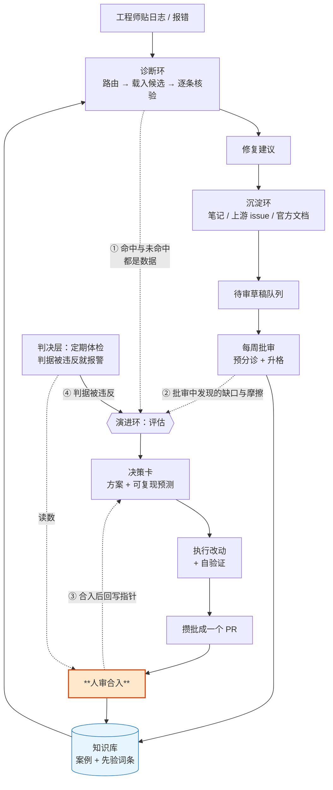
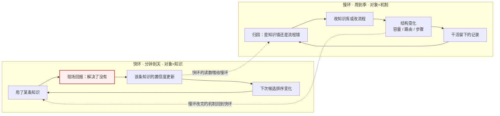
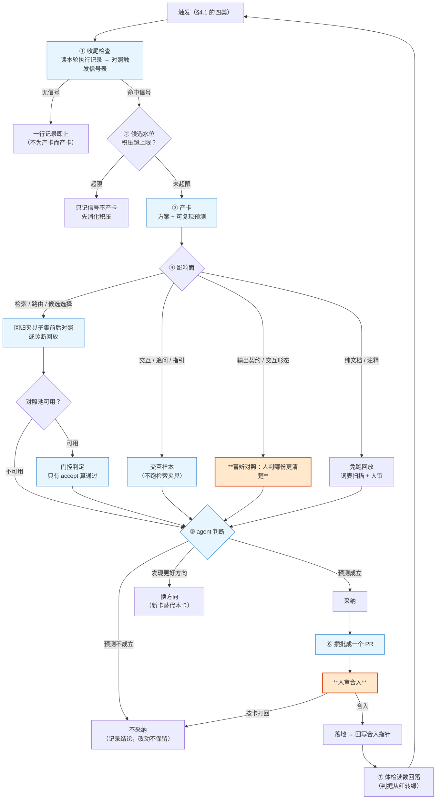

# RSI 自演进元机制：设计与实现

> **这是自演进机制的唯一技术入口。** 想知道"这套东西怎么运转、我什么时候要出手、哪些地方已经不用我管"，读这一篇就够。
> 其余 `mechanism/*.md` 是**论证层**——只在你要改机制本身时才读（各管哪一段见本文 §8）。
>
> 本文不写死任何会腐烂的数字：条数与容量看 `knowledge/_index.yaml` 头注，卡数与预测口径看
> `python3 scripts/ev_measure.py --audit`，指标时序看 `metrics/timeline.yaml`，判据阈值看
> `proposals/gates.yaml` 与 `metrics/gates.yaml`。手写的数字会腐烂且不报错。

---

## 1. 三分钟地图

**RSI（递归自我改进）**在这里的意思很朴素：**系统在干活的过程中顺手改自己，改完的东西下次干活就用得上。**
它不是"跑一轮自我升级"，而是把"这次做完能不能更好"变成每次干活的默认收尾动作——像人做事时顺手记下"下次别这么干"。

系统里同时跑着三条环路。**把它们混起来读是理解这套机制最大的障碍**，所以先分清：

| 环路 | 什么时候发生 | 谁触发 | 产出 |
|---|---|---|---|
| **诊断环**（分钟级） | 每次出问题 | 工程师贴日志 | 修复建议 + 一份诊断记录 |
| **沉淀环**（每次定位结束 / 每周批处理） | 诊断结束、或批量导入上游材料 | 定位的人、或例行拉取 | 待审草稿 → 审核后进入知识库 |
| **演进环**（内容流程收尾 / 全库体检轮） | 上面两环产生数据之后 | **自动**（收尾时伴随执行）或人显式要求 | 决策卡 → 改动 → 自验证 → 攒批送审 |

三者共用一条链：**前两环产生数据，演进环读数据改机制，改完回落到前两环。**
链条每一段都要能回答"凭什么说它变好了"——那是 §5 的评估闭环与 [eval.md](eval.md)、[git-workflow.md](git-workflow.md) 管的事。

四类触发点（上图的 ①–④）就是"**什么时候会发生演进**"的完整答案，展开在 §4.1。

---

## 2. 名词对照：黑话 → 白话

系统里有两层词汇：**工程层**（脚本、CI、机制文档里的名字，改起来成本高，本文不动）与**业务层**（这套机制到底在干什么）。
下表是两层的对照。**只读人读面的人，看右两列就够。**

### 2.1 机制与流程

| 你会看到的名字 | 白话 | 它在做什么 |
|---|---|---|
| 自演进（self-evolving） | 系统改自己 | 把"这次做完能不能更好"变成默认收尾动作 |
| 演进评估 / 收尾检查（evolve-check） | 收尾时顺手看一眼 | 内容流程做完时自动跑：有信号才产卡，没信号一行即止 |
| 深度轮（self-evolve） | 全库体检轮 | 人显式说"看看有什么可改进"时，跨轮聚合信号找改进点 |
| 决策卡 / 提案卡（EV 卡） | 一张"我打算这么改"的档案 | 记录：为什么改、预测什么、怎么验证、最后采纳没采纳 |
| 产卡 | 立一个改进项 | 方案成形才立卡；只有想法不立 |
| 判决层 / 判据（gates） | 体检指标 | 每条判据 = 一个读数 + 一条越界线 + 一句该做什么 |
| 体检器 | 跑体检的脚本 | 判据全绿 / 有要动作的 / 判不了，三态退出码 |
| 水位 | 积压量 | 已验证但没回写合入指针的卡数；超上限就停产新卡 |
| 指针回写 | 把 PR 号抄回卡里 | 不回写会让"缺合入指针"这条判据把已合入的卡读成没合入 |
| 攒批 PR | 一批改动一次送审 | 批边界：目标完成 / 攒够批上限（数值见 orchestration §2.4）/ 深度轮停止 |
| 归因 | 判错在哪一侧 | 知识错就改知识库，流程错就改 skill——这个区分防止误改本来正确的知识 |
| 退休 / 复活 | 归档与取回 | 版本过期或长期无效的条目移出活跃索引；从没被选中的罕见条目**不**退休 |

### 2.2 评估与验证

| 你会看到的名字 | 白话 | 它测什么、什么强度 |
|---|---|---|
| 可复现预测（measure） | "一条命令 + 期望值" | 卡里必须写：reviewer 一条命令就能复核预测是否成立 |
| 判词（accept / weak_accept / reject） | 接受 / 证据不足 / 拒绝 | **只有"接受"算通过**；"证据不足"是如实记录，不是通过 |
| 封存对照集（holdout） | 钉住不许动的量尺 | 按内容哈希封存：改了或删了就红。硬门 |
| 回归夹具（golden fixture） | 固定输入 + 期望输出 | 改流程后重跑，确认原来能命中的没被改坏。运行本身是约定 |
| 证据台账（scorecard） | "跑过什么"的账 | 进 CI 的是**记录不陈旧**，不是命中率达标 |
| 两阶段加载 | 先看摘要，再看正文 | 先按索引摘要挑出最多 5 个候选，再打开正文逐条核验 |
| 案例（case） | 一条"症状 → 根因 → 修法" | 检索与诊断的基本单位 |
| 先验词条（reference） | 与具体事故无关的事实/方法 | 不参与候选排序；只在"缺测量数据"与"缺判断依据"两个缺口处被读 |
| 诊断记录（trace） | 一次诊断的全过程 | 含证据、决策依据、给用户的输出；误诊归因靠它 |
| 诊断回放（replay） | 拿历史问题重跑一遍 | 用**外部已经解决**的问题来检验知识库现在能不能命中 |
| 对照池 / 评测台（arena） | 一批题 + 一把尺 | 同一批题上前后的对照评分，防止"改量尺绕过回归" |
| 交互样本（ixn） | 测"问得对不对"的样本 | 测追问与信息充分性，**不测**检索命中 |
| 反馈通道 S1 / S2 | 两条互不混算的通道 | S1 = 现场解决没有（工程师回报）；S2 = 内容与外部结论一致不一致（自动对照） |
| 自证 / 非独立 | 同一份证据不数两次 | 医生给自己开诊断书不算独立验证：来源自己回报的、或正文引用过的样本，只记"非独立" |
| 盲测 | 先作答再看答案 | 回放时先写自己的结论、再对照外部答案，顺序不能反 |

---

## 3. 一级反馈环：内容越用越准（快环）与机制越用越对（慢环）

这是整套设计的理论骨架：**同一个系统里有两个速度和两个作用对象都不同的学习环。**

**红框那一步是当前最大的空洞**：快环的输入是"工程师回报 fix 结果"，而这条回报通道实测长期没有分母。
后果不是一个指标难看，而是**这条环没有分母**——命中率、误诊率、校准全部只能标"不可解读"。
用体检器的话说：**"零误诊"和"没人回报"在数据上是同一个样子**，所以不许读成前者。

慢环则不依赖现场回报：它读的是干活时**已经**留下的记录（诊断记录、回放结果、流程摩擦），
这也是"沉淀上游 issue"这条路线的价值——**那些问题的答案在沉淀时就已经在手上**。

---

## 4. 演进环的主线：从触发到落地

### 4.1 什么时候会发生演进（四类触发点）

| # | 触发 | 谁发起 | 覆盖什么 |
|---|---|---|---|
| ① | **内容流程收尾的伴随评估** | agent 自动（不需要人说"改进系统"） | 本轮干活产生的数据：新沉淀、未命中、重复动作、流程摩擦 |
| ② | **批审中发现缺口与摩擦** | agent 自动（批审收尾同上） | 知识库的覆盖缺口与结构问题 |
| ③ | **人显式要求全库体检轮** | 人 | 跨轮聚合：归因聚类、容量、回放未测条目、指标漂移 |
| ④ | **判决层报出被违反的判据** | 人跑体检（周批动作） | 机制自身在腐化：积压、引用腐烂、口径缺失、外部验证停滞 |

> 注意 ④ 的现状：**判据能报，但没有人自动去跑它**。这一步现在是周批的一个手动动作。
> 它同时也是 §6 里"哪些节点可以退出"的第一条候选——缺的不是读数，是"谁在什么时候读"。

### 4.2 主线状态机

三种终局的比例本身就是一条读数：**如果只有"采纳"和"换方向"、从来没有"不采纳"，那么采纳记录不能单独作为质量结论**
——那说明这个生成器缺一种拒绝域（外部研究把这件事说得很直白，见 §7）。

### 4.3 每个环节的判据与数据

| 环节 | 判据（怎么算数） | 数据落在哪 |
|---|---|---|
| 收尾检查 | 有没有触发信号；有没有落收尾记录（"跑了但无信号"与"根本没跑"必须可区分） | 执行记录（运行时件，随克隆共享） |
| 产卡 | 卡的每一处都要能追到出处；预测必须是一条命令 + 期望，或如实声明不可度量 | 决策卡文件（进 git） |
| 执行 + 自验证 | 改哪测哪（§4.2 的门禁分级）；预测写不出可复现口径 = 它还不是一个可证伪的假设 | 预测实测记录（运行时件） |
| agent 判断 | 卡是有生命周期的档案：提案 → 执行 → 验证 → 判断，缺一环算卡不完整（进 CI 校验） | 卡内追加式决策记录 |
| 攒批送审 | 批边界明确；每卡独立提交（可逐卡撤回） | PR + 回写指针 |
| 落地回读 | 回写指针后，体检读数才是真的 | 判据读数 |

**两条不能破的纪律**（都是拿实测换来的）：
① **产卡即执行**——只有想法、没有可执行方案，不产卡（防想法清单污染账本）；
② **不能改自己的考卷**——指标口径与评分定义只有人能改，agent 不得自改评分定义。

### 4.4 五个演化动作，每个都配一道护栏

演进环能改的东西只有五类。**每一类都配一道对应的护栏**——防的不是"改错"，是"越学越错"。

| 演化动作 | 作用对象 | 什么时候发生 | 护栏（挡住什么） |
|---|---|---|---|
| **置信度校准** | 单条知识的置信度 | 每次收到现场反馈 | 只按已回报的结果回写；同一问题连续两次未解决即转人工（挡误诊级联） |
| **知识注入** | 知识库条目 | 每次定位结束 / 每周批审 | 人审队列 + 语义校验 + 高风险双签（挡错误知识入库） |
| **误诊归因** | 知识库 **或** 流程 | 每次误诊 | 先读诊断记录判"错在哪一侧"（挡"执行错时误改本来正确的知识"） |
| **结构演化** | 目录 / 路由 / 容量 | 数据触发（如容量到上限） | 数据触发而非预先规划；改动走高风险双签（挡"按日历重构"） |
| **退休与复活** | 活跃索引的成员 | 每周 | 只退休版本过期或长期无效的条目；**从没被选中的罕见条目不动**（挡"过早退休"把正确的罕见知识删掉） |

三道横切的护栏适用于全部五类动作：
**建议与决定分离**（自动化只产出建议加证据，采纳永远由人执行）、
**一切升级由数据触发**（不按日历排期，也不追随技术趋势）、
**对照标准不可由被测方改**（封存对照集的分级与重新封存权限）。

### 4.5 一次现场反馈的完整数据流

这套机制里唯一的"快环"输入，走三个写入点，**git 归属刻意不同**：

| 写入点 | 写什么 | 进 git？ | 为什么 |
|---|---|---|---|
| 诊断记录 | 过程 + 一条"等待回报结果"的待办 | 否（含客户现场信息） | 运行时状态，定位结束后留在本地 |
| 知识条目 | 置信度（命中 / 误诊 / 分数 / 最近命中） | 是（走知识修改 PR） | 学习环的持久知识：命中加一必须入库，才能改变下次候选排序 |
| 索引 | 分数（生成物） | 是 | 条目一变就要重建索引，随同一个 PR 走；CI 强制同步 |
| 指标源文件 | 每期一条观测 | 是 | **周节奏、人复核**：脚本产出骨架，人看分母后再落期 |

要点：**每次反馈直接写的是知识条目**（那是学习环的持久状态），指标时序是周期性的观测汇总，
不是反馈的即时回写。而"必须入库"不等于"每单立刻开 PR"——结算与入库按周批走一次。

---

## 5. 评估怎么闭环

演进环最容易虚化成"我觉得改好了"。这里用四层约束把它钉住，**从弱到强**：

| 强度 | 手段 | 挡住什么 | 谁来判 |
|---|---|---|---|
| 记录不陈旧 | 证据台账进 CI | "夹具改过而没人重跑"与"跑过了就是这样"不可区分 | 机械 |
| 预测可复现 | 卡里的"一条命令 + 期望" | 只写在散文里、无法证伪的"改进" | 机械（任何 reviewer 一条命令） |
| 前后无回归 | 改前 / 改后对照 | 改坏了原来能命中的场景 | 机械 |
| **量尺不可自改** | 封存对照集按内容哈希钉住 | 同一双手既改被测对象、也改对照标准 | 机械 + 人（谁能重新封存是半硬的，见 §6） |

**"能红的门"才算门。** 一个从没红过的检查与没有检查，在观测上不可区分——所以硬门都有对应的
"故意弄坏看它会不会报错"的负例断言（闭环演练脚本逐条做这件事）。
这条也是外部研究明确给出的准入标准，不是本仓自创的洁癖。

**已知例外（别把上一段读成全覆盖）**：演进体检器的那几条判据**还没有**负例断言——它们现在绿，
但没有证据证明它们红得起来。"读数是绿的"与"这道门是硬的"之间的差，就是 §10 第 2 条。

**诚实退化**是这里的第四条纪律：数据源缺席时判据说"判不了"，不写 0 冒充"没问题"。
因此体检器的退出码是三态——**全绿 / 有要动作的 / 判不了**——把"没触发"和"没检查过"分开。

---

## 6. 人参与点与"可退出条件"

这是最能回答"哪些地方以后不用我管"的一张表。
**"可退出条件"= 缺什么才能把这个节点交给 agent**，是可核对的，不是愿望。

| 节点 | 现在谁做 | 为什么现在必须人做 | 可退出条件（缺什么） | 判定 |
|---|---|---|---|---|
| 发起深度体检轮 | 人 | 系统不知道业务上现在该关心什么；深度轮被刻意关掉了自动发起 | 需要一个不依赖人的触发源：判据越界是可机械读出的，缺的是"定时或在收尾时去读它" | **部分可退**（见下） |
| 产卡 / 执行 / 自验证 / 判采纳 | **agent** | — | — | **已退出**（这是已交出去的部分） |
| 攒批 PR 合入 | 人 | 当卡的验证是自定口径时，评审是唯一的外部约束 | ①该面有**能红**的硬门；②预测由**外部**来源判定，而不是自证 | **部分可退**：有硬门的面可退，自证面不可 |
| 结构性改动（骨架 / 路由 / 新 skill 立项） | 两人双签 | 影响面无法局部验证 | —（设计上不由 agent 单独决定） | **不可退** |
| 重新封存对照集 | 维护者 | 量尺不能由被测方改 | 把量尺交给独立的第二方持有（代码所有者机制落实后）；注意受益人是"换个持有人"，不是 agent | **可退（换个持有人）** |
| 指标口径与评分定义 | 人 | 系统不改自己的考卷 | — | **不可退** |
| 指标源文件落期（复核分母） | 人 | 分母为 0 时读数会被读成"没问题" | 现场反馈通道有自动化替代（当前没有） | **现不可退** |
| 现场反馈回报 | 工程师 | 唯一能回答"fix 在你那儿解决了没有"的来源 | 无机械替代——外部对照只能答"内容对不对"，答不了"现场解不解决"（严重性语义、环境特异性只认现场） | **结构性不可退** |
| 触发信号表的维护 | owner | 实测表与真实信号族脱钩（多数卡落不进设计表） | 先要 owner 定"扩表覆盖真实信号族"还是"收窄行为、把表外信号归一" | **待决策** |

**唯一一条"部分可退"的具体形态**（发起体检轮）：现在体检器已经能机械报出"哪条判据被违反、
该做什么动作"，缺的是**谁在什么时候去读它**。可退出的形态是把"跑体检"挂到已有的收尾动作上，
让判据越界本身成为一个触发源（上表 §4.1 的 ④）。**但它退出的前提是先有一条能红的判据**——
报不出问题的体检器，退出去也只会安静地绿。

---

## 7. 外部依据：这套设计不是自创的

下表把外部研究与本仓的具体设计对上。出处均为公开论文/会议，调研物料在仓库外的本地目录（不进机制文档体系）。

| 外部研究 | 它证明了什么 | 本仓哪条设计是它的落点 |
|---|---|---|
| [Knowledge-Centric Self-Improvement](https://arxiv.org/abs/2607.19592)（Stanford / Caltech） | 自我改进的持久对象应是**受治理的知识库**而不是 agent：改进因此可审、可迁移、可移植，能迁到未见任务与不同模型家族 | "知识库是资产、agent 可弃"这条总的论题；三级知识与 skill 自包含 |
| [RSEA](https://arxiv.org/abs/2606.28374) | 在独立封存集上"严格更好才留下"是递归自演化保持单调安全的条件；对照的无闸门在线策展：一个基准近最优、另一个崩到 0.14 | 封存对照集按内容哈希钉住 + "此前通过的不许变失败" |
| [PACE：随时有效的接受检验](https://arxiv.org/abs/2606.08106) | 短板在**接受规则**而不是提案者；"分数涨了就收"重复多次等于 agent 对自己做多重检验（有真改进时也高达三到四成假接受） | 评测台改成同批题配对比较 + 复用折减，判词三态只有"接受"算通过 |
| [Ratchet](https://arxiv.org/abs/2605.22148)（Amazon） | 判定器把**失败误判为通过**时，任何样本量都退不掉一条坏知识；自写内容的增益接近 0，人写的增益显著为正 | 自证与命中分离；来源自己回报的、正文引用过的样本只记"非独立" |
| [Library Drift](https://arxiv.org/abs/2605.19576)（FAGEN@ICML 2026） | 不维护的库会漂移到"注入了反而更差"；**过早退休同样是主动有害** | 命名空间容量上限 + 软退休；罕见但正确的条目不退休 |
| [StarHarness](https://arxiv.org/abs/2608.24804)（ServiceNow） | 把演化池三分（提案者可见 / 对提案者隐藏 / 另留泛化）后，增益在被排除出演化过程的任务上仍然保持 | 候选池与封存集分离；对提案者隐蔽的选样集待池规模达标后再评估 |
| [Falsifiable Release Gates](https://arxiv.org/abs/2607.13070) | **不能红的闸门与没有闸门在观测上不可区分**；作者用自己的规则要求"故意弄坏被校验对象，看校验器会不会给出最短反例" | 闭环演练脚本的负例断言：改封存夹具必红、删必红、重新封存需打标签 |
| [大 skill 库检索比较](https://arxiv.org/abs/2608.06196) | 用关系图/嵌入替换词法召回会**显著更差**；作者自写的查询会把命中率高估最多 44 点 | 检索不上向量库；评测查询必须来自真实记录，不信作者构造 |
| [Agent Skills Can Be Harmful](https://arxiv.org/abs/2608.11888) / [SkillsBench](https://arxiv.org/abs/2602.12670) | 更大更全的 skill 反而更差；最大的效率退化来源是**过度验证**（把验收清单变成必须执行的工作） | skill 聚焦、行为规则内联；不把判断性规范硬化成 CI 门 |
| [Safe Harness Self-Evolution](https://arxiv.org/abs/2609.08175) | 生成与认证是**两个不同约束**；评估受限时多产候选并不提高成功更新的保证 | 反对以产卡数量为进度指标；候选水位治理（超限停产新卡） |

**读这张表的纪律**：它们是**背书与准入标准**，不是可以直接抄的结论——外部系统与这里的对象、
数据规模都不同。每一条落到本仓都经过一次"合不合用"的判决（判决与落地状态见调研物料；
被否决的替代方案进 `docs/adr/`）。

---

## 8. 权威归属：改哪件事读哪篇

**一件事只有一个权威处**，其余文档都是论证或引用。改之前先看这里说的是哪篇：

| 你要做的事 | 权威文档 |
|---|---|
| 判断某个设计/改动是否合规 | [design-principles.md](design-principles.md) |
| 写给人看或给人审的文本（报告 / 记录字段 / 面板文案 / 卡 / 词条 / PR body） | [writing-norms.md](writing-norms.md) |
| 改一个流程的行为 | `skills/<name>/SKILL.md`（流程必须自包含，不依赖 docs/） |
| 改测评门禁 / 跑回归 | [eval.md](eval.md) |
| 走 PR / 门控 / 多人协作 | [git-workflow.md](git-workflow.md) |
| 看指标口径 / 跑周批 | [metrics.md](metrics.md) |
| 查"演进闭环自己健不健康"的判据定义 | [mechanism/pipeline.md](mechanism/pipeline.md) §7.1（判据数据在 `proposals/gates.yaml`，判决命令是体检器） |
| 改演进机制本身 | [mechanism/pipeline.md](mechanism/pipeline.md)（状态机与卡 schema）、[mechanism/execution.md](mechanism/execution.md)（信息契约与验证）、[mechanism/orchestration.md](mechanism/orchestration.md)（会话与预算）、[mechanism/run.md](mechanism/run.md)（持续运行） |
| 做评测机制（元层 / 交互面） | [mechanism/eval-arena.md](mechanism/eval-arena.md)、[mechanism/ixn-replay.md](mechanism/ixn-replay.md) |
| 排下一步工作 / 评估能否推广 | [roadmap.md](roadmap.md)、[rollout-assessment.md](rollout-assessment.md) |
| 查"当初为什么这样选" | `docs/adr/` |

> **关于代号**：内部记账号（计划事项、治理缺口、触发信号、落地阶段）**只在各自的计划文档里裸用**；
> 机制文档、PR body、卡正文要引用就写中文含义。规则见 [glossary.yaml](glossary.yaml) 的生存范围字段与
> [git-workflow.md](git-workflow.md)「人读性与代号约定」。

---

## 9. 每周做什么（runbook）

机制只有落到每周的动作上才算存在。

| 节奏 | 动作 | 命令 / 入口 | 产物 |
|---|---|---|---|
| 每次诊断后 | 回报修复结果（下次诊断启动时会追问，不另开审讯） | 回答诊断流程的追问 | 该条知识的置信度更新 |
| 定位结束后 | 沉淀知识 | `/skill:to-postmortem`、`/skill:to-reference` | 待审草稿 |
| 内容流程收尾 | 伴随演进评估（有信号才产卡，无信号一行即止） | `/skill:evolve-check` | 决策卡，或一行无信号记录 |
| 每周 | 批处理待审队列、升格、去重、退休、重建索引 | `/skill:knowledge-groom` | 知识变更 PR |
| 每周 | 产出指标快照并落一期（**任何人跑周批时都可做**） | `python3 scripts/metrics_snapshot.py --kind live` → 人复核 → 写 `metrics/timeline.d/` → `build_timeline.py` → `metrics_health.py` | 一个期号源文件 + 重建的时序数据 |
| 每周 | 批量拉取上游 issue | `/skill:issue-ingest` | 待审草稿 + 导入游标 |
| 每周 | **演进闭环体检**（积压 / 可证伪面 / 外部验证停滞 / 引用腐烂 / 对照池复用） | `python3 scripts/evolution_health.py` | 逐条判据的 ✓/✗ + 下一步动作 |
| 随时 | reviewer 判定一张卡 | `python3 scripts/ev_measure.py <卡号> --run` | 符合 / 被证伪 / 无法判定（并落一笔实测记录） |
| 全库体检时 | 深度观测轮 | `/skill:self-evolve` | 候选卡 + 攒批 PR |
| 每季度 | 闸门数值复核 + 就绪度重估 | [roadmap.md](roadmap.md)、[rollout-assessment.md](rollout-assessment.md) | 阈值修正 |

**先看体检器再下结论**：没有它，"零误诊"与"没人回报"看起来是一样的。

---

## 10. 已知缺口（不写死数字）

按危害排序，每条都带判据——**判据是让你能自己核对，不是让你相信本文**。

1. **快环的输入是空的**（根因问题）：现场反馈回报通道没有分母。
   判据：指标体检器把命中率、误诊率、校准一律标成**不可解读**（它由现场反馈捕获计数驱动；计数为 0 时它拒绝下"无异常"结论）。
   后果：主线里的"越用越准"目前无法被证明。**补它的动作不在机制侧**——在让真实工程师跑完一次诊断并回报结果。
2. **判决层的门没有被证明会响**：闭环演练对封存对照集、卡规则、执行记录有负例断言，
   但**演进体检器的那几条判据没有任何负例断言**——判据现在绿，不代表它红得起来。
3. **外部验证通道尚未产出第一条独立记录**：通道已建、选样纪律已写（样本必须既不是该条知识的来源、
   又未被其正文引用），但至今没有一条"另一个现场撞上同一条知识"的独立验证。
4. **对照池规模不足以做门控判定**：池子小到配对检验够不到判定线，实测判词只能落在"证据不足"。
   它是**验证样本通道**，不是门控池。
5. **触发信号表与真实信号族脱钩**：多数卡落不进设计表——不是卡写错了名字，而是表既不是枚举、
   也没覆盖真实触发空间。属设计决策，待 owner 定"扩表"还是"收窄行为"。
6. **判据阈值全是未经校准的假设**：越界线的数值是估计值，标注为"接受实测重校"，尚无一条被实测校准。
   所以"全绿"的强度是**弱**的：它证明"没越过我猜的线"，不证明"线画在对的地方"。
7. **部分评测面无判据**：性能类问题的数值断言、平台键控分支、修复正确性、严重性行为（高危不给修法）
   ——这几面目前无任何自动判定。判据：封存对照集的覆盖报告报出"有知识却没有夹具"的格子。

机制细节见 §8 的论证层文档；**改动机制之前先读 [design-principles.md](design-principles.md) 与 [eval.md](eval.md)**（门禁分级与"改量尺"的规矩）。
